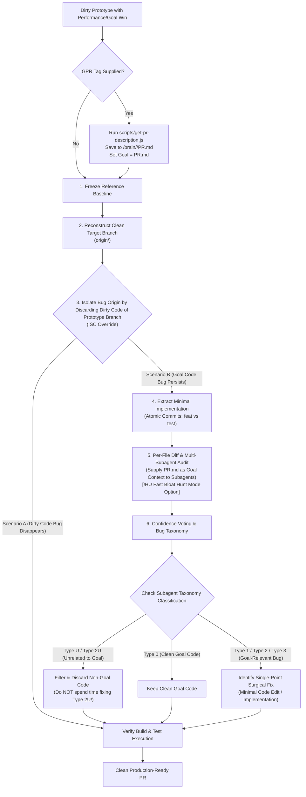

# Afterplay: Post-Prototype Distillation & Diff Audit

Use **Afterplay** when a prototype branch achieves a critical performance win or complex goal (the **Goal**), but the codebase has become dirty, unmaintainable, or contains subtle bugs.

Afterplay provides a disciplined 6-phase pipeline to freeze reference baselines, reconstruct clean target branches, isolate bugs, extract minimal clean abstractions, run multi-subagent diff audits, and cast confidence votes on every modified file using an extended 6-tier bug & goal-relevance taxonomy (`Type 0`, `Type 1`, `Type 2`, `Type 3`, `Type U`, `Type 2U`).

---

## Workflows



---

## Execution Phases

### Phase 1: Freeze Reference Baseline & Goal Specification
1. Tag dirty prototype state to freeze the reference anchor:
   ```bash
   git tag -a "dirty-code-<goal>-but-<symptom/bug>" -m "dirty reference baseline"
   ```
2. Preserve dirty prototype in an independent reference directory or worktree:
   ```bash
   git worktree add ../<goal>-dirty-reference <dirty-prototype-branch>
   ```
3. If `!GPR<PR_ID/URL>` is supplied, execute `node scripts/get-pr-description.js <PR_ID/URL> -o "<appDataDir>\brain\<conversation-id>\PR.md"` to establish `PR.md` as the authoritative Goal specification.
4. Record quantitative baseline goal metrics (e.g. latency, test pass rate, memory usage, or feature completion criteria).

### Phase 2: Reconstruct Clean Target Branch
1. Create clean untouched branch from `origin/<target-base-branch>`:
   ```bash
   git checkout -b <clean-target-branch> origin/<target-base-branch>
   git tag -a "clean-code-<goal>-but-<symptom/bug>" -m "clean target baseline"
   ```
2. Cherry-pick or re-implement clean minimal abstractions from `<goal>-dirty-reference`.

### Phase 3: Isolate Bug Scenario
Distinguish whether reported bugs belong to dirty prototype wrappers (**Scenario A**) or core goal changes (**Scenario B**):
- **Scenario A (Bug Disappears on Clean Branch)**: Bug stemmed from dirty prototype wrappers (e.g. unused adapters). Discard dirty code and proceed to build/test verification.
- **Scenario B (Bug Persists on Clean Branch)**: Bug stems directly from core goal implementation changes. Proceed immediately to Phase 4 and Phase 5.

### Phase 4: Extract Minimal Implementation
Extract essential abstractions into atomic commits on the clean branch, stripping speculative bloat and separating test bypass code:
```bash
git reset HEAD~1
git add path/to/ProductionFile1.ext path/to/ProductionFile2.ext
git commit -m "feat: <goal-commit-description>"
git add path/to/DevBypassFile.ext
git commit -m "test: <dev-bypass-or-test-description>"
```

### Phase 5: Per-File Diff & Multi-Subagent Audit
1. Export individual `.diff` files against base target branch (`origin/<target-base-branch>` or base commit) using `scripts/export-diffs.js`:
   ```bash
   node scripts/export-diffs.js <base-commit-or-branch> -o "<appDataDir>\brain\<conversation-id>" [--update] [--json]
   ```
   *(Use `--update` to incrementally re-export only changed files when new PR commits are pushed. For complete CLI flags, options, and JSON manifest specs, read [SCRIPTGUIDE.md](SCRIPTGUIDE.md) via `view_file`).*
2. **Incremental Re-Audit Rule (`--update --json`)**: For cases where previous `/afterplay` audit results already exist, when running `export-diffs.js --update --json` following new commits/pushes on a PR: The main agent MUST inspect the `isUpdated` boolean field in the JSON output. Only spawn subagents for diff files where `isUpdated: true`. Diffs with `isUpdated: false` MUST reuse their previous subagent audit classifications and confidence scores.
3. Spawn $N$ subagents concurrently using `invoke_subagent` (1 subagent per updated diff file).
   *(If `!HU` tag is supplied, run Subagents in **Bloat Hunt Mode** focusing exclusively on identifying Type U / Type 2U diffs to strip before running full bug analysis).*
4. Supply each subagent with: assigned `.diff` path, full codebase access (`file://`), `PR.md` Goal specification path (if `!GPR` was invoked), goal baseline metrics, and bug symptoms.
5. **Per-Hunk Classification & Line-Weighted % Breakdown Rule**: Instruct subagents to evaluate the diff at the granular **Git Hunk level** (`@@ -L,N +L,M @@` or logical block):
   - Assign a category code (`Type 0`, `Type 1`, `Type 2`, `Type 3`, `Type U`, `Type 2U`) to *each individual hunk*.
   - Calculate the percentage breakdown of each Type based on changed line counts: `% Type X = (lines in Type X / total changed lines in diff) * 100%`.
   - Provide an overall file action recommendation (e.g. **Full Keep**, **Partial Strip** [reverting only `Type U` hunks], **Surgical Fix**, or **Full Discard**).
6. See [REFERENCE.md](REFERENCE.md) via `view_file` for the exact ready-to-use subagent prompt template and per-hunk schema.

### Phase 6: Confidence Voting & Extended Taxonomy Matrix
1. Collect subagent assessments across Goal criticality (feature, perf, bugfix, refactor impact), per-hunk classifications, changed-line percentage breakdowns, confidence levels (0-100%), and 6-tier bug & goal taxonomy:

| Category Code | Name | Description | Action Strategy |
| :---: | :--- | :--- | :--- |
| **Type 0** | **Clean / Clear** | Changes in diff/hunk are completely unrelated to the reported bug and are contributing to Goal. | **Keep** clean Goal code/hunk |
| **Type 1** | **Missing Code** | Bug occurs because new code for the Goal feature is missing (existing code is fine). | **Implement** missing Goal logic |
| **Type 2** | **Existing Code Bug** | Bug occurs because of a defect in pre-existing code contributing to Goal. | **Surgical Fix** pre-existing code |
| **Type 3** | **Both** | Bug is caused by a combination of pre-existing code defects AND missing code for Goal. | **Implement + Surgical Fix** |
| **Type U** | **Unrelated to Goal** | Code does not contribute to Goal (accidental prototype bloat / dead code). | **Strip / Discard** hunk or file |
| **Type 2U** | **Unrelated Buggy Code** | Bug is in pre-existing or prototype code that is unrelated to and does not contribute to Goal. | **Strip / Discard** (do NOT waste time fixing!) |

2. Compile all assessments into `<appDataDir>\brain\<conversation-id>\subagents_diff_and_bug_analysis.md`.
3. Process action recommendations based on per-hunk taxonomy and percentage breakdown:
   - **Full Discard**: Discard diffs where `Type U` + `Type 2U` > 80% of changed lines.
   - **Partial Strip**: For mixed files, selectively revert/patch out `Type U` / `Type 2U` hunks while retaining `Type 0` clean Goal hunks.
   - **Surgical Fix**: Pinpoint minimal surgical line edits for `Type 1/2/3` hunks.
4. See [REFERENCE.md](REFERENCE.md) via `view_file` for subagent markdown/JSON schemas and consensus report templates.

---

## Domain Terms and Tag Commands

The afterplay skill supports specialized modifier tags and domain terminology to control post-prototype distillation and subagent diff review:

- **`Goal`**: Primary feature, bugfix, performance win, or refactor target achieved during initial prototyping.
- **`Scenario A`**: Bug originating strictly from dirty prototype wrappers or unused boilerplate (discarded on clean branch).
- **`Scenario B`**: Bug originating directly from core goal implementation changes.
- **`!SC<A|B>` (Scenario Choice)**: Force bug classification to Scenario A or B mid-flight in Phase 2 to skip empirical isolation testing.
  - **Syntax/Parameter**: `!SC<A|B>` (Default: Auto-detected via empirical branch test).
  - **Timing**: Start-time.
  - **Agent Action**: Forces bug classification to Scenario A (dirty code bug) or Scenario B (goal code bug).
- **`!HU` (Hunt Unrelated / Bloat Hunter Pass)**: Restrict subagent diff audit in Phase 5 to prioritize hunting Type U (Goal-unrelated bloat) and Type 2U (unrelated buggy code).
  - **Syntax/Parameter**: `!HU`.
  - **Timing**: Start-time / Mid-flight.
  - **Agent Action**: Instructs spawned subagents to run a lightweight pass exclusively identifying non-goal code for immediate stripping, bypassing heavy surgical fix analysis on non-essential diffs.
- **`!GPR<PR_ID/URL>` (Get PR Goal Specification)**: Fetch pull request description via `scripts/get-pr-description.js` and establish `PR.md` as the Goal context for subagents.
  - **Syntax/Parameter**: `!GPR<PR_ID/URL>` (e.g. `!GPR12`, `!GPR1857`, `!GPRhttps://github.com/owner/repo/pull/1857`).
  - **Timing**: Start-time.
  - **Agent Action**: Runs `node scripts/get-pr-description.js <PR_ID/URL> -o "<appDataDir>\brain\<conversation-id>\PR.md"`, assigns `PR.md` as the Goal specification, and instructs all spawned subagents to read `PR.md` when evaluating diff contribution to Goal.
