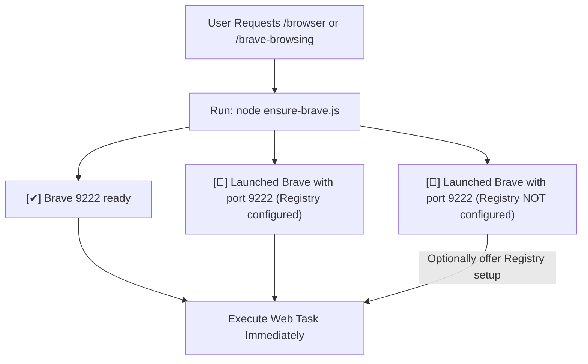

# Brave Browsing with Chrome DevTools MCP

## Fast Connection Protocol (Agent Execution Rule)

Whenever invoked via `/browser` or `/brave-browsing`, agents MUST run the helper script FIRST before taking any other action:

```powershell
node D:\Projects\myskills\productivity\brave-browsing\scripts\ensure-brave.js
```

### Workflows



### Script Output States:

1. **`[✔] Brave 9222 ready`**: Port 9222 is active and listening. **Proceed directly to browser automation task with zero delay.**
2. **`[🚀] Launched Brave with port 9222 (Registry configured)`**: Brave was launched automatically with remote debugging port 9222. **Proceed to browser automation task.**
3. **`[🚀] Launched Brave with port 9222 (Registry NOT configured). Consider configuring Registry to streamline workflow.`**: Brave was launched via CLI flags. **Proceed to browser automation task, and optionally offer user Registry setup.**

## Domain Pointers

- **First-Time MCP & Registry Setup**: For configuring `mcp_config.json` or persistent Windows Registry launch flags, read [SETUP.md](SETUP.md) via `view_file`.
- **Extension Popup Automation**: For bypassing active-tab restrictions on Chrome Extension Popups (`chrome-extension://...`), read [EXTENSION-POPUP.md](EXTENSION-POPUP.md) via `view_file`.

## Completion Checklist
- [ ] Ran `ensure-brave.js` helper script.
- [ ] Confirmed Brave connection on port 9222.
- [ ] Executed user's web task without hesitation.
