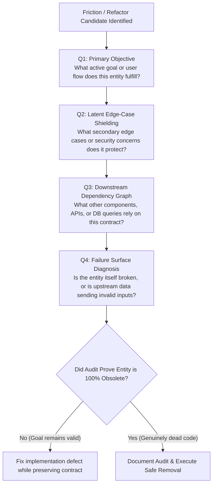

# Chesterton's Fence Intent Audit Protocol

Analyze why an existing system structure, feature, validation rule, or configuration was built BEFORE proposing to delete, disable, or dilute it.

## When to Use

- Before deleting or replacing any legacy code block, validation rule, or feature flag.
- When an existing component causes friction during debugging or refactoring.
- When asked to evaluate whether dead code or legacy rules are safe to remove.
- When invoked explicitly via `/chestertons-fence` or `/intent-audit`.

## The 4-Quadrant Intent Audit Workflow



## Mandatory Audit Report Template

When executing this skill, output the following structured report BEFORE making code changes:

```markdown
### 🛡️ Chesterton's Fence Intent Audit

**Target Entity**: `<file-path / symbol-name / feature-name>`

1. **Primary Objective (Q1)**:
   - What problem was this logic originally built to solve?

2. **Latent Edge-Case Shielding (Q2)**:
   - What edge cases, security validation, or user workflows rely on this?

3. **Downstream Dependency Graph (Q3)**:
   - What modules, APIs, or database queries depend on this contract?

4. **Failure Surface Diagnosis (Q4)**:
   - Is this entity broken, or is upstream sending invalid input?
   - **Classification**: `[Broken Contract]` vs `[Implementation Defect]`

---

**Recommendation**:
- [ ] **Preserve Contract & Fix Defect** (Fix code bug while keeping feature intent)
- [ ] **Safe Safe Removal** (Empirically verified 100% obsolete dead code)
```

## Core Governance Directives

1. **Distinguish Contract vs Defect**: Never confuse a *broken feature contract* with an *implementation defect*. If the feature's goal is valid, fix the implementation code—do NOT delete the feature.
2. **Upstream Data Investigation**: Check if runtime errors originate from invalid upstream data providers before blaming the downstream enforcer.
3. **Audit Before Action**: Present the completed Intent Audit report to the user and obtain alignment before deleting structural entities.
