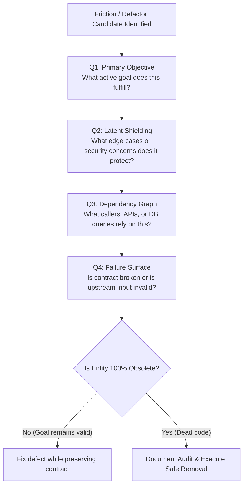

# Chesterton's Fence

Analyze why an existing system structure, feature, validation rule, or configuration was built BEFORE deleting, disabling, or modifying it.

## Decision Workflow



## Audit Report Output

Output this structured report and obtain user alignment BEFORE making code changes:

```markdown
### Chesterton's Fence Intent Audit

**Target Entity**: `<file-path / symbol-name / feature-name>`

1. **Primary Objective (Q1)**: Problem this logic was originally built to solve.
2. **Latent Edge-Case Shielding (Q2)**: Edge cases, security checks, or flows relying on this.
3. **Downstream Dependency Graph (Q3)**: Modules, callers, or DB queries depending on this contract.
4. **Failure Surface Diagnosis (Q4)**: `[Broken Contract]` vs `[Implementation Defect]`. Upstream vs local failure.

---

**Recommendation**:
- `[PRESERVE & FIX]`: Fix code bug while preserving domain contract.
- `[SAFE REMOVAL]`: Verified 100% dead code / obsolete contract.
```

## Directives

1. **Distinguish Contract vs Defect**: If the feature's goal remains valid, fix the implementation defect; NEVER delete or dilute the contract.
2. **Trace Upstream First**: MUST verify if runtime errors originate from invalid upstream data providers before altering downstream enforcers.
