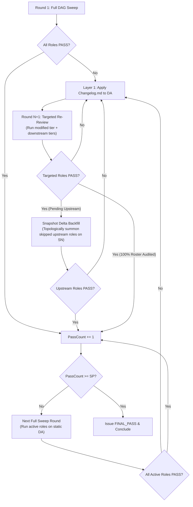

# Conduct Deep Reviewing Loop

Multi-agent review loop using isolated domain reviewers, topological dependency routing, and independent gatekeeping to verify Directive Artifacts (DA).

## Execution Architecture

| Layer | Agent | Primary Responsibility |
| :--- | :--- | :--- |
| **Layer 1** | Main Agent | Spawns Layer 2 Host, applies clean DA mutations from `Changelog.md`, presents final output. |
| **Layer 2** | Review Host & Critical Gate | Dynamically selects active reviewers in `Reviewer_Choice_Rationale.md`, summons active reviewers using invariant prompts, purges `reports/` before passes, isolates host artifacts in `host/`, executes Snapshot Delta Backfill for skipped upstream roles, writes `Analyzation.md` and `Changelog.md`. |
| **Layer 3** | Domain Reviewers | Independent specialist subagents (up to 11 roles across 4 Tiers) executing domain audits per `<Role>-REVIEWER-GUIDE.md`. |

## Workflow

### Step 1: Initialize Workspace

Create `.scratch/deep_review/host/` and `.scratch/deep_review/reports/`. Initialize `.scratch/deep_review/Context.md` with target DA path, cross-referenced DAs with dependency lineage (`Upstream` / `Downstream` and `Implemented` / `Unimplemented`), codebase rules (`AGENTS.md`), task domain skills, criteria, and static `SP` threshold.

### Step 2: Spawn Review Host & Critical Gate (Layer 2)

#### 2A. Define Host Subagent Type (Prerequisite)
If `review_host` is not already defined in the active session, call `define_subagent` to register the subagent type:
- `name`: `"review_host"`
- `description`: `"Host and Critical Gate for multi-agent deep reviewing loop"`
- `enable_subagent_tools: true` *(Mandatory: equips Host with `invoke_subagent` and `manage_subagents` to summon Layer 3 reviewers)*
- `enable_write_tools: true` *(Mandatory: equips Host to write `Analyzation.md`, `Changelog.md`, and `Reviewer_Choice_Rationale.md`)*
- `enable_mcp_tools: true`
- `system_prompt`: Provide Host operational instructions referencing `REVIEW-HOST-GUIDE.md`, `PROTOCOL.md`, and `HOW-TO-PICK-UP-THE-RIGHT-OPINIONS.md`.

#### 2B. Summon Review Host
Invoke the registered `review_host` subagent via `invoke_subagent`:
- `TypeName`: `"review_host"`
- `Role`: `"Review Host & Critical Gate"`
- `Prompt`:
`You are Review Host & Critical Gate. Target DA: <da_path>. System Rules: AGENTS.md. Execution Protocol: PROTOCOL.md. Opinion Filtering: HOW-TO-PICK-UP-THE-RIGHT-OPINIONS.md. Context File: .scratch/deep_review/Context.md. Dynamically select active reviewers in .scratch/deep_review/host/Reviewer_Choice_Rationale.md, execute DAG routing for active roles, spawn reviewers using invariant prompts, filter feedback, and generate Analyzation.md and Changelog.md in .scratch/deep_review/host/.`

### Step 3: Handle Host Verdict

Read `.scratch/deep_review/host/Analyzation.md`.

| Verdict in `Analyzation.md` | Action |
| :--- | :--- |
| `ROUND_REVISION_NEEDED` | Read `.scratch/deep_review/host/Changelog.md`. • **If `!PA` / `!WA` active**: STOP execution immediately before modifying DA. Output standardized quota pause message (requesting keyword `"C"` to apply edits and proceed). • **Upon receiving `"C"` (or if no pause tag)**: Apply edits to DA using Clean & Neutral Artifact Protocol. If `Changelog.md` includes `## Target Directive Artifacts Synchronization (Context.md)`, update `.scratch/deep_review/Context.md`. Re-spawn/revive Layer 2 Host for Round N+1 (Host consumes Changelog on start). |
| `ROUND_PASS` | Re-spawn Layer 2 Host for next Full Sweep round on unchanged DA. |
| `FINAL_PASS` | Conclude review loop (`PassCount >= SP`). Present fully verified DA to user. |

## Modifiers

| Command | Action |
| :--- | :--- |
| `!SP<N>` | Set required continuous Full Sweep PASS rounds threshold to N (Default: 1). |
| `!PA` / `!WA` | Pre-mutation pause gate: When Host returns `ROUND_REVISION_NEEDED`, Main Agent stops immediately before mutating DA, prompts user to check quota, and awaits keyword `"C"` to apply `Changelog.md` (and update `Context.md` if DA list changed) and launch Round N+1. Remains active across the entire review loop until `FINAL_PASS`. |
| `!FPA` | Instantly kill running subagents and pause execution. |
