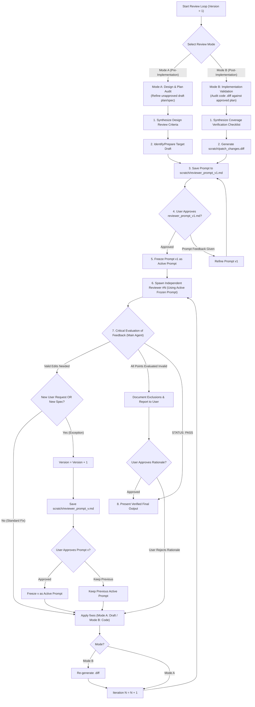

# Conduct Reviewing Loop

Run iterative, independent subagent reviews to stress-test plans (pre-implementation) or validate codebase diffs against approved specifications (post-implementation) against explicit user and system criteria.

## Dual-Mode Architecture & Workflows

### 1. Mode Selection & Review Matrix

| Mode | Target Artifacts | Primary Goal | Reviewer Action | Termination Condition |
| :--- | :--- | :--- | :--- | :--- |
| **Mode A: Design & Plan Audit** *(Pre-Implementation)* | Draft `implementation_plan.md`, PRD, Skill RFC | Discover architectural gaps, edge cases, and design flaws before coding | Output numbered edits to the **draft document** | `STATUS: PASS` or User-Approved Invalid Rationale |
| **Mode B: Implementation Validation** *(Post-Implementation)* | Approved Plan + `.diff` Artifact + Codebase Files (`src/`, `tests/`) | Verify 100% plan coverage, zero regressions, and full spec compliance | Output numbered missing plan items or defects in the **codebase** | `STATUS: PASS` or User-Approved Invalid Rationale |

### 2. Mode B `.diff` Artifact Workflow

For **Mode B (Post-Implementation Validation)**:
1. **Generate `.diff` Artifact**: Run `git diff origin/<default-branch>` (or target base branch, capturing both committed and working tree edits) and save the untruncated patch to `<appDataDir>\brain\<conversation-id>\scratch\patch_changes.diff`.
2. **Provide 3-Way Context**: Supply the subagent reviewer with:
   - Approved `implementation_plan.md` path.
   - `.diff` artifact path (`scratch/patch_changes.diff`).
   - Core codebase implementation files (`src/`, `tests/`).
3. **Iterative `.diff` Regeneration**: In Mode B, after applying codebase fixes in iteration $N$, the Main Agent MUST re-generate `scratch/patch_changes.diff` before spawning Reviewer $N+1$.
4. **Immutable Plan Principle**: In Mode B, the approved plan is treated as immutable. Reviewers must NOT request edits to the plan; any discrepancy between plan and code must be resolved by fixing the **codebase**.

### 3. Reviewer Loop Protocol (Blind Protocol & Approval Gate)

> [!IMPORTANT]
> **Prompt Persistence & Approval Gate Protocol**:
> 1. **Save Prompt to File**: Save every reviewer prompt as a markdown file inside `<appDataDir>\brain\<conversation-id>\scratch\reviewer_prompt_v1.md`.
> 2. **Initial User Approval Gate**: Present `scratch/reviewer_prompt_v1.md` to the user and **AWAIT EXPLICIT USER APPROVAL** before spawning Reviewer #1.
> 3. **Immutable Active Prompt Reuse**: Freeze the approved prompt as Active Prompt ($P_{active}$) and reuse it 100% identically for subsequent reviewers (#2, #3... #N), changing only the Reviewer ID.
> 4. **Prompt Revision Exception (v1 $\rightarrow$ vN)**: Prompt updates (`reviewer_prompt_v<Version>.md`) are permitted ONLY if triggered by explicit user instructions, a newly discovered High-Level Specification, or user-approved exclusions/non-goals (Mode B), all of which require prior user approval.
> 5. **Preventing Blind Reviewer Deadlocks**: If reviewer suggestions are evaluated as invalid/YAGNI by the Main Agent and approved by the User, the rejected items MUST be recorded under an explicit **Out-of-Scope / Non-Goals** section in the document (Mode A) or added as non-goals in `reviewer_prompt_v<Version>.md` (Mode B) so subsequent blind reviewers do not re-raise them.

> [!WARNING]
> **Critical Evaluation Rule (Main Agent Gatekeeper)**: ALWAYS evaluate reviewer feedback critically against YAGNI, empirical codebase facts, and repository rules (`AGENTS.md`). Do NOT blindly apply over-engineered or hallucinated reviewer suggestions.

---

## Output Templates & Checklists

See [REFERENCE.md](REFERENCE.md) for Reviewer Prompt Templates (Mode A & Mode B) and Checklist Builders.
