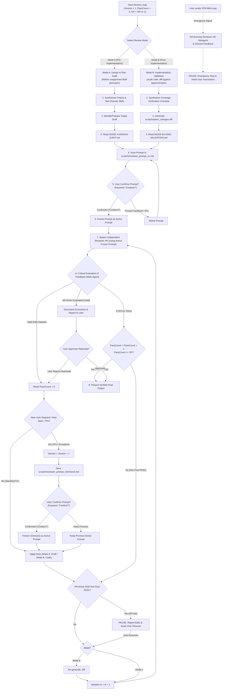

# Conduct Reviewing Loop

Run iterative, independent subagent reviews to stress-test plans (pre-implementation) or validate codebase diffs against approved specifications (post-implementation) against explicit user and system criteria.

## Dual-Mode Architecture & Workflows

### 1. Mode Selection & Review Matrix

| Mode | Target Artifacts | Primary Goal | Reviewer Action | Termination Condition |
| :--- | :--- | :--- | :--- | :--- |
| **Mode A: Design & Plan Audit** *(Pre-Implementation)* | Draft `implementation_plan.md`, PRD, Skill RFC | Discover architectural gaps, edge cases, and design flaws before coding | Output numbered edits to the **draft document** | `Final PASS` ($\text{PassCount} = \text{SP}$) or User-Approved Invalid Rationale |
| **Mode B: Implementation Validation** *(Post-Implementation)* | Approved Plan + `.diff` Artifact + Codebase Files (`src/`, `tests/`) | Verify 100% plan coverage, zero regressions, and full spec compliance | Output numbered missing plan items or defects in the **codebase** | `Final PASS` ($\text{PassCount} = \text{SP}$) or User-Approved Invalid Rationale |

### 2. Mode B `.diff` Artifact Workflow

For **Mode B (Post-Implementation Validation)**:
1. **Generate `.diff` Artifact**: Run `git diff origin/<default-branch>` (or target base branch, capturing both committed and working tree edits) and save the untruncated patch to `<appDataDir>\brain\<conversation-id>\scratch\patch_changes.diff`.
2. **Provide 3-Way Context**: Supply the subagent reviewer with:
   - Approved `implementation_plan.md` path.
   - `.diff` artifact path (`scratch/patch_changes.diff`).
   - Core codebase implementation files (`src/`, `tests/`).
3. **Iterative `.diff` Regeneration**: In Mode B, after applying codebase fixes in iteration $N$, the Main Agent MUST re-generate `scratch/patch_changes.diff` before spawning Reviewer $N+1$.
4. **Immutable Plan Principle**: In Mode B, the approved plan is treated as immutable. Reviewers must NOT request edits to the plan; any discrepancy between plan and code must be resolved by fixing the **codebase**.

### 3. Reviewer Loop Protocol (Blind Protocol & Approval Gate)

> [!IMPORTANT]
> **Prompt Persistence & Approval Gate Protocol**:
> 1. **Synthesize Task Domain Skills & Read Templates**: Call `view_file` on `MODE-A-DESIGN-AUDIT.md` (Mode A) or `MODE-B-CODE-VALIDATION.md` (Mode B) to retrieve lean prompt templates. Always include [REVIEWER-DESIGN-AUDIT.md](REVIEWER-DESIGN-AUDIT.md) (Mode A) or [REVIEWER-CODE-VALIDATION.md](REVIEWER-CODE-VALIDATION.md) + [REVIEWER-ANTI-LAZINESS.md](REVIEWER-ANTI-LAZINESS.md) (Mode B) alongside task domain skills under `Required Reading` in the synthesized reviewer prompt. NEVER pass `SKILL.md`, `MODE-A-DESIGN-AUDIT.md`, or `MODE-B-CODE-VALIDATION.md` to Subagents.
> 2. **Save Prompt to File**: Save every reviewer prompt as a markdown file inside `<appDataDir>\brain\<conversation-id>\scratch\reviewer_prompt_v1.md`.
> 3. **Initial User Approval Gate (Disambiguated)**: Present `scratch/reviewer_prompt_v1.md` to the user and **AWAIT EXPLICIT KEYWORD "Conduct?"** (or *"Conduct review"*) before spawning Reviewer #1. *Do NOT ask using "Approve" or "Proceed" for prompt authorization to prevent lower-tier models from confusing prompt confirmation with direct Tier 3 plan/source approval.*
> 4. **Immutable Active Prompt Reuse**: Freeze the approved prompt as Active Prompt ($P_{active}$) and reuse it 100% identically for subsequent reviewers (#2, #3... #N), changing only the Reviewer ID.
> 5. **Prompt Revision Exception (v1 $\rightarrow$ vN)**: Prompt updates (`reviewer_prompt_v<Version>.md`) are permitted ONLY if triggered by tag `!PU`, explicit user instructions, a newly discovered High-Level Specification, or user-approved exclusions/non-goals (Mode B), all of which require prior user approval (awaiting keyword *"Conduct?"*).
> 6. **Preventing Blind Reviewer Deadlocks**: If reviewer suggestions are evaluated as invalid/YAGNI by the Main Agent and approved by the User, the rejected items MUST be recorded under an explicit **Out-of-Scope / Non-Goals** section in the document (Mode A) or added as non-goals in `reviewer_prompt_v<Version>.md` (Mode B) so subsequent blind reviewers do not re-raise them.
> 7. **Clean & Neutral Artifact Rule (Anti-Anchoring)**: When updating the draft document (Mode A) to satisfy feedback from Reviewer $N$, NEVER inject past reviewer references, version tags based on reviewers (e.g. *"v4 per Reviewer #3"*), or meta-changelogs into the document body. Write all edits seamlessly as native, standard specifications so subsequent blind reviewers evaluate the draft without anchoring bias.

> [!WARNING]
> **Critical Evaluation & Non-Blocking Churn Guard (Main Agent Gatekeeper)**: ALWAYS evaluate reviewer feedback critically against YAGNI, empirical codebase facts, and repository rules (`AGENTS.md`). Do NOT blindly apply over-engineered or hallucinated reviewer suggestions.
> - **Non-Blocking Churn Guard**: Items listed under `Suggestions for Improvement (Optional / Non-blocking)` do NOT affect `STATUS: PASS`. The Main Agent **MUST NOT** edit the draft plan, modify codebase files, or reset `PassCount` based on non-blocking suggestions. Non-blocking suggestions must be noted as optional future backlog items and must never trigger revision iterations unless the user explicitly commands it.

---

## Subdoc References

- **Main Agent Orchestration Guides**:
  - Mode A (Design & Plan Audit): see [MODE-A-DESIGN-AUDIT.md](MODE-A-DESIGN-AUDIT.md).
  - Mode B (Code Implementation Validation): see [MODE-B-CODE-VALIDATION.md](MODE-B-CODE-VALIDATION.md).
- **Subagent Reviewer Rubrics**:
  - Design & Plan Audit Discipline (Mode A): see [REVIEWER-DESIGN-AUDIT.md](REVIEWER-DESIGN-AUDIT.md).
  - Code Coverage Validation Discipline (Mode B): see [REVIEWER-CODE-VALIDATION.md](REVIEWER-CODE-VALIDATION.md).
  - Anti-Laziness & Output Completeness (Mode B only): see [REVIEWER-ANTI-LAZINESS.md](REVIEWER-ANTI-LAZINESS.md).

---

## Domain Terms and Tag Commands

The conduct-reviewing-loop supports specialized modifier tags and domain terminology to control execution flow, reviewer pass counts, and prompt updates. User might invoke these commands in either uppercase or lowercase:

- **`PassCount`**: The current unbroken streak of continuous reviewer `STATUS: PASS` evaluations. Increments on `PASS` and resets to `0` if any reviewer returns `STATUS: REVISIONS NEEDED`.
- **`Final PASS`**: The last required PASS (where $\text{PassCount} = \text{SP}$) verifying the reviewed object and concluding the review loop.
- **`Active Prompt`**: The frozen, user-approved reviewer prompt file (`scratch/reviewer_prompt_v<Version>.md`) reused identically for all blind reviewers in the active loop.
- **`!SP<N>` (Set Pass-count Threshold)**: Specifies the number of continuous PASSes required from independent subagents to conclude the review loop.
  - **Syntax/Parameter**: `!SP<N>` (Default: `1`).
  - **Timing**: Start-time.
  - **Agent Action**: Sets pass threshold `SP = N`. Requires $N$ continuous PASSes before declaring `Final PASS`.
- **`!PU [Instructions]` (Prompt Update)**: Triggers an explicit prompt revision mid-loop.
  - **Syntax/Parameter**: `!PU [Instructions/Criteria]` (Default: Prompt update instructions provided in argument).
  - **Timing**: Mid-flight.
  - **Agent Action**: Advances prompt version to $v(\text{Version}+1)$, writes `scratch/reviewer_prompt_v<Version+1>.md` incorporating new instructions, presents it for user confirmation (awaiting keyword `"Conduct?"`), and freezes it as active prompt upon approval.
- **`!PA` (Pause After)**: Pauses the review loop after applying reviewer fixes.
  - **Syntax/Parameter**: `!PA`.
  - **Timing**: Mid-flight.
  - **Agent Action**: Pauses execution after applying fixes per current reviewer feedback (if valid fixes were applied), presents edit summary, and awaits explicit user resume command before spawning reviewer $N+1$. Skipped on `Final PASS`.
- **`!FPA` (Force-Pause)**: Emergency mid-loop brake sent while a reviewer is actively running.
  - **Syntax/Parameter**: `!FPA`.
  - **Timing**: Mid-flight.
  - **Agent Action**: Immediately kills running reviewer subagent via `manage_subagents` (Action: `kill`), discards feedback, prevents code/draft edits, and pauses execution awaiting user instructions.
