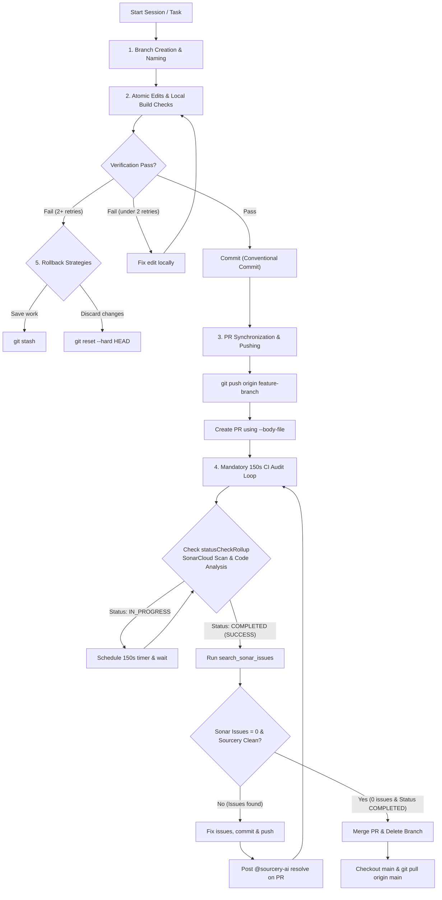

# Git Lifecycle Management

Use this skill to maintain a clean git history with atomic commits, manage pull requests dynamically, execute reliable 150s CI audit loops, and handle safe rollbacks during complex coding sessions.

## Quick Start

```bash
# 1. Start a feature branch from fresh main
git fetch origin
git checkout -b feature/user-auth

# 2. Make an atomic edit, test it, and commit
# (edit code/tests...)
npm run typecheck && npm run build:vite
git add -A && git commit -m "feat(auth): implement basic JWT validation"

# 3. Create PR (use --body-file to avoid PowerShell escaping issues)
$env:GITHUB_TOKEN=$null; gh pr create --title "feat(auth): implement JWT validation" --body-file "scratch/pr-body.md" --head "feature/user-auth" --base "main"

# 4. Schedule 150s timer for CI audit loop
# (Wait for SonarCloud Scan & Sourcery review to complete)
```

## Workflows & Operational Rules



---

### 1. Branch Creation & Naming
- Create a branch from the latest base branch (e.g., `main` or `develop`).
- Format branch names clearly: `feature/<short-desc>`, `bugfix/<issue-id>`, or `chore/<task-name>`.

---

### 2. Atomic Commits
- **Rule**: Each commit must contain exactly one logical change and its corresponding tests/documentation.
- **Size**: Keep edits small. Do not bundle multiple unrelated refactors or features in one commit.
- **Messages**: Follow Conventional Commits: `feat:`, `fix:`, `refactor:`, `test:`, `docs:`, `chore:`.
- **Pre-commit**: Always run tests or compilation checks before committing to ensure the HEAD is never broken.

---

### 3. Continuous PR Synchronization & CLI Credentials
- On the first commit, create a Pull Request using `gh pr create`.
- **Dummy Token Bypass**: Sandbox environments inject `GITHUB_TOKEN=github_pat_...` by default, causing `gh` CLI commands to fail with `401 Unauthorized`. Always prefix `gh` commands with `$env:GITHUB_TOKEN=$null` in PowerShell (or `set GITHUB_TOKEN=` in CMD) to fall back to the system keyring (e.g. `$env:GITHUB_TOKEN=$null; gh pr view <id>`).
- **PowerShell Escape Safeguard**: Never pass complex Markdown strings containing backticks (```) directly via `--body "..."` in PowerShell strings to avoid Unicode/Escape parser errors. Always write the PR description to a local markdown file under `scratch/pr<id>-body.md` and use `gh pr create --body-file "scratch/pr<id>-body.md"`.
- As subsequent atomic commits are added, dynamically update the PR description to list new changes and prevent description drift. Refer to [create-and-update-pr](file:///d:/Projects/YumeShelf/.agents/skills/create-and-update-pr/SKILL.md).

---

### 4. Mandatory 2-Step Sonar & Sourcery Audit Gate Check
When running the 150s timer audit loop after pushing commits or opening PRs:

1. **Step 1 — Verify CI Run Completion First (`statusCheckRollup`)**:
   - MUST check `$env:GITHUB_TOKEN=$null; gh pr view <id> --json statusCheckRollup` FIRST.
   - MUST confirm that both `SonarCloud Scan` AND `SonarCloud Code Analysis` have status **`COMPLETED`** with conclusion **`SUCCESS`**.
   - **CRITICAL**: If CI check status is still `IN_PROGRESS`, DO NOT run `search_sonar_issues` or claim 0 issues prematurely! Wait for the 150s timer to expire or re-check `statusCheckRollup`.

2. **Step 2 — Query Sonar Issues After CI Completion**:
   - ONLY AFTER `statusCheckRollup` is confirmed `COMPLETED`, run `search_sonar_issues({ projectKey, pullRequest })`.
   - If any issues exist, remediate them, commit, push, and post `$env:GITHUB_TOKEN=$null; gh pr comment <id> --body "@sourcery-ai resolve"`.
   - Repeat the 150s timer loop until `search_sonar_issues` returns `total: 0` AND all CI checks are `COMPLETED`.
   - Once all status checks pass 100% and 0 issues remain, execute `$env:GITHUB_TOKEN=$null; gh pr merge <id> --merge --delete-branch` and run `git checkout main && git pull origin main`.

---

### 5. Rollback and Revert Strategies
- **Test Failure**: If a change fails verification/tests and is not fixable within 2 iterations:
  - Run `git stash` to save current work, or `git reset --hard HEAD` to discard the failing iteration.
  - Return to the last known stable commit.
- **Incorrect Path**: If a design approach is deemed incorrect:
  - Find the commit hash before the path diverged.
  - Run `git reset --soft <commit-hash>` to keep changes for modification, or `git reset --hard <commit-hash>` to discard them completely.
