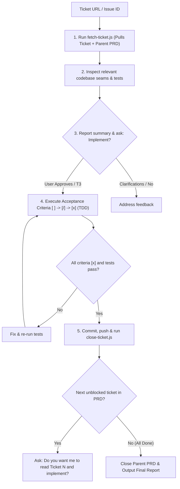

# Implement a Ticket

Execute mature, well-specified tickets directly from their acceptance criteria without recreating redundant implementation plans.

## Directives

1. **Zero-Plan Mandate (No Re-planning)**: NEVER generate a new `implementation_plan.md` when a ticket already contains an explicit Acceptance Criteria checklist. The ticket's checklist IS the execution plan.
2. **Context Pre-fetch**: Run `node <skill-dir>/scripts/fetch-ticket.js <ticket-id-or-url>` to download both the ticket and its parent PRD to `.scratch/tickets/`.
3. **Targeted Seam Exploration**: Inspect only the codebase seams and tests relevant to the current ticket before execution.
4. **Single-Step Progression**: Mark progress directly on the ticket criteria: `[ ]` -> `[/]` (max 1 active) -> `[x]`.
5. **Empirical Verification**: Run test commands (`npm test`, build checks) to prove each acceptance criterion passes before marking `[x]`.
6. **Atomic Close & Handoff**:
   - Commit changes referencing the ticket (e.g. `feat(scope): title (closes #<id>)`).
   - Run `node <skill-dir>/scripts/close-ticket.js <ticket-id>` on completion.
   - If next unblocked ticket exists: ask `"Do you want me to read Ticket <N> and implement?"`.
   - If all tickets in PRD are done: close parent PRD and output delivery summary.

---

## Workflow



---

## Execution Steps

### 1. Fetch & Brief
Run:
```bash
node <skill-dir>/scripts/fetch-ticket.js <ticket-number-or-url>
```
Read the generated `.scratch/tickets/ticket_<number>.md` and its parent PRD `.scratch/tickets/prd_<parent>.md` using `view_file`.

Inspect relevant codebase files using `jcodemunch` or test files. Present a concise briefing:
- **Ticket**: `#<number> — <Title>`
- **Parent PRD**: `#<parent>`
- **Touched Seams**: Key files / modules to modify
- **Acceptance Criteria**: `<N>` items to fulfill

Ask the user: `"Implement Ticket #<number>?"`

### 2. Execute & Verify
Upon user approval, take the Acceptance Criteria checklist from the ticket. Execute step by step:
1. Mark active item `[/]`.
2. Write unit/integration tests first or alongside code.
3. Make minimal edits.
4. Verify tests pass.
5. Mark `[x]` and advance to next item.

### 3. Commit, Close & Frontier Transition
1. Commit atomic changes: `git commit -m "feat(<scope>): <message> (closes #<number>)"`.
2. Close the ticket on tracker:
```bash
node <skill-dir>/scripts/close-ticket.js <ticket-number> --comment "Implemented and verified with unit tests."
```
3. Check PRD / frontier for dependent tickets:
   - If next ticket exists: ask `"Do you want me to read Ticket <next-number> and implement?"`.
   - If all tickets in parent PRD are completed:
     ```bash
     node <skill-dir>/scripts/close-ticket.js <parent-prd-number> --comment "All child tickets completed and verified."
     ```
     Report final summary to user.
