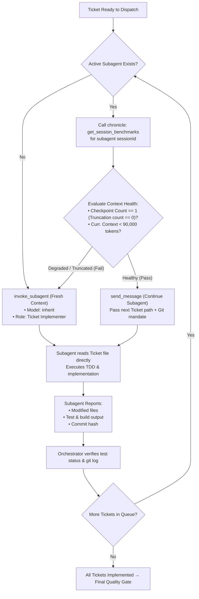

# Implement With Subagents

Orchestrate multi-ticket or multi-step execution using sequential subagents, empirical context monitoring via `chronicle`, and strict separation of specs from orchestrator prompts.

## Core Principles

1. **Zero Specs in Prompt (No Prompt Telephone Game)**:
   - The orchestrator prompt MUST NOT summarize, paraphrase, or re-explain requirements or acceptance criteria.
   - The prompt contains ONLY:
     - Target Ticket / Plan / Spec artifact path.
     - Git operational instructions (target branch, conventional commit template, issue closing directive `closes #XX`).
     - Tool and verification directives (e.g., test commands, linters).
   - The subagent MUST read the artifact file directly from disk.

2. **Sequential Ticket Execution**:
   - Dispatch one ticket at a time to ensure atomic commits, clean git history, and conflict-free testing.

3. **Data-Driven Context Lifecycle Management**:
   - Before assigning the next ticket to an existing subagent, inspect its context health using `chronicle` MCP tool `get_session_benchmarks`.
   - Never guess whether a subagent is degraded or truncated.

---

## Workflow Decision Tree



---

## Step-by-Step Execution Guide

### Step 1: Dispatch Prompt Formulation

When launching (`invoke_subagent`) or reusing (`send_message`) a subagent, format the prompt strictly following this template:

```markdown
Implement Ticket: <Ticket-Title>
- Target Ticket: <path-to-ticket-file.md> (Issue #<ID>)
- Parent Spec / PRD: <path-to-prd-or-spec.md>

Directives:
1. Work on branch: `<branch-name>`.
2. Execution Mandate:
   - Read the Target Ticket and Parent Spec files directly from disk. Do not assume or guess specifications.
   - Follow `implement-a-ticket` / `tdd` skill workflows.
   - Use MCP `patchitright` for code edits.
   - Run verification commands: `<test-command>` and `<build-command>`.
   - Git commit & push: `<type>(<scope>): <summary> (closes #<ID>)`.
3. Report back with:
   - List of modified/created files
   - Test execution logs proving 100% pass rate
   - Git commit hash
```

### Step 2: Context Health Evaluation via Chronicle

When a subagent reports completion and another ticket is pending, check the subagent's session metrics:

```json
// Tool Call: chronicle -> get_session_benchmarks
{
  "sessionIds": ["<subagent-conversation-id>"]
}
```

#### Decision Matrix

| Metric | Formula / Value | Action | Rationale |
| :--- | :--- | :--- | :--- |
| **Truncation Count** | `Checkpoint Count - 1` | If $> 0 \rightarrow$ **SPAWN NEW** | The subagent context was truncated and compressed; reasoning precision is degraded. |
| **Current Context** | `Curr. Context` tokens | If $\ge 90,000 \rightarrow$ **SPAWN NEW** | Context window is near capacity; risks mid-turn truncation on next ticket. |
| **Clean Context** | `Checkpoint Count == 1` AND `Curr. Context < 90,000` | **REUSE SUBAGENT** | Subagent has full reasoning history and healthy token headroom. Saves startup tool calls. |

---

## Checklist for the Orchestrator (Main Agent)

- [ ] Did I refrain from summarizing ticket requirements in the prompt?
- [ ] Is the ticket file path explicitly provided and valid?
- [ ] Is the git commit convention and issue number clearly stated?
- [ ] Did I run `get_session_benchmarks` before sending a new ticket to an existing subagent?
- [ ] Did I verify the commit on the target branch after the subagent reported done?
