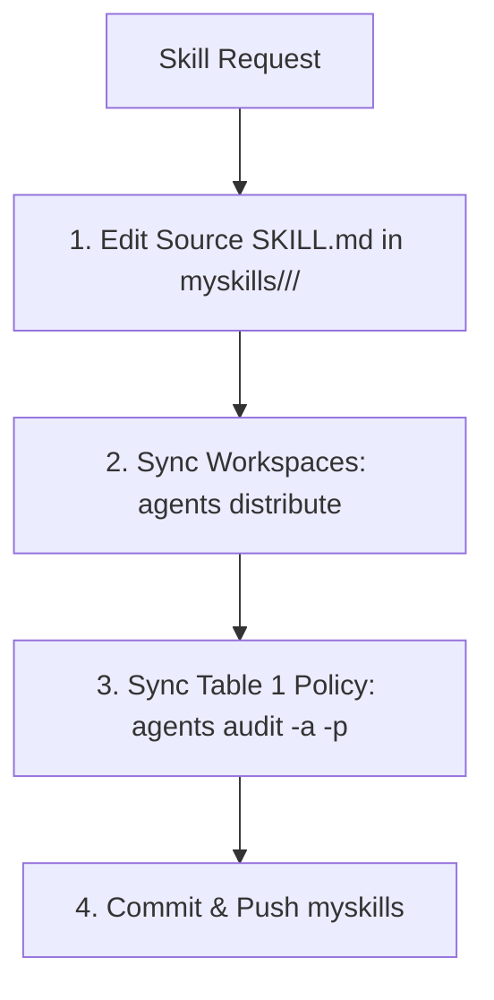

# Manage Custom Skills

Author skills in the central `myskills/` source catalog, then distribute them to project workspaces and IDE targets.

## Workflow



## Core Rules

1. **Source-First Mandate**: ALWAYS edit skills directly in `<myskills-root>/<category>/<skill-name>/SKILL.md`. NEVER edit project-local copies in `.agents/skills/` (they are overwritten on distribution unless frontmatter sets `local: true`).
2. **Lookup Tooling**:
   - Find source path: `agents info skill.<skill-name>` (or `agents where` for root).
   - Read skill stdout: `agents read skill.<skill-name>`.
3. **Distribution**: Run `agents distribute` (or `agents distribute -t .` for current repo only) to sync changes to workspaces and IDE configs (`~/.gemini`, `~/.claude`, `~/.cursor`).
4. **Policy Audit**: Run `agents audit -a -p` after adding, renaming, or deleting skills to sync `Table 1` in `AGENTS.md`.

## Categories & Frontmatter

| Category | Domain Scope |
| :--- | :--- |
| `design/` | UI/UX, styling, frontend aesthetics, mobile/web comps |
| `engineering/` | Architecture, TDD, debugging, domain modeling, refactoring |
| `quality/` | Sonar remediation, code reviews, benchmark testing |
| `productivity/` | Automation workflows, PRs, AI writing, issue triage |
| `personal/` | Notes, writing drafts, Obsidian vault management |

```yaml
---
name: <skill-name>
description: <Concrete capability>. Use when [specific triggers].
---
```

## CLI Reference

| Command | Action |
| :--- | :--- |
| `agents distribute` | Sync all skills to all registered project workspaces and IDEs |
| `agents distribute -t <path>` | Sync skills to a specific project directory |
| `agents audit` | Check policy coverage without modifying files |
| `agents audit -a -p` | Add missing skills to Table 1 and prune deleted skills from `AGENTS.md` |
