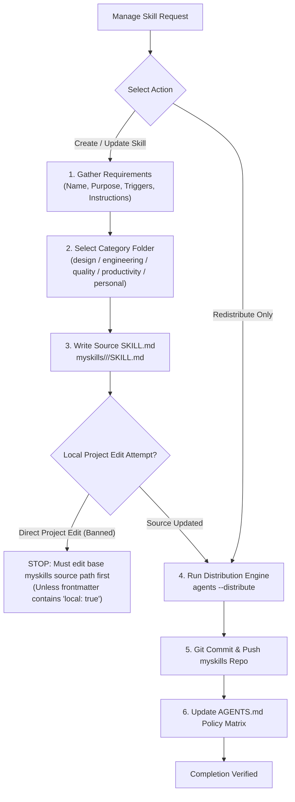

# Manage Custom Skills

Enforce single-source-of-truth skill management by writing skills directly to the central `myskills` source catalog before distributing across local project workspaces and multi-IDE environments.

---

## Workflows



---

## 1. Gather Requirements

Before scaffolding or editing a skill, confirm:
1. **Name**: Skill identifier (e.g. `my-awesome-skill`).
2. **Purpose**: Core capability summary for YAML description.
3. **Triggers**: Explicit conditions and keywords that trigger loading ("Use when...").
4. **Instructions**: Required workflows, decision trees, guidelines, and commands.

---

## 2. Category Selection & Source-First Execution

Always modify or create skills directly in the central source repository:
`Path: <projects-dir>/myskills/<category>/<skill-name>/SKILL.md`

> [!IMPORTANT]
> **Source Location Lookup & Reading Protocol**: When working inside any project repository:
> 1. To inspect source location metadata, run `agents info skill.<skill-name>`.
> 2. To read raw skill instructions or auxiliary subdocs directly to stdout, run `agents read skill.<skill-name>` (or `agents read skill.<skill-name>/<subdoc-name>`).
> 3. **ONLY edit the source file in `myskills` directly.** NEVER modify local project copies inside `.agents/skills/` (local edits will be overwritten).
> 4. After editing the source file in `myskills`, run `agents distribute` (or `agents distribute -t .`) to sync changes back to local project workspaces and active IDE global targets (`~/.gemini`, `~/.claude`, `~/.cursor`).

### Standard Categories:
- `design/`: Layout, visual aesthetics, UI taste, styling, mobile/web comps.
- `engineering/`: Architecture, TDD, debugging, domain modeling, refactoring.
- `quality/`: Sonar remediation, code reviews, benchmark testing, git guardrails.
- `productivity/`: Workflow automation, skill management, PR generation, triage, AI writing.
- `personal/`: Obsidian vault management, article editing, draft shaping.

### Frontmatter Format:
```yaml
---
name: <skill-name>
description: <Capability description>. Use when [specific triggers].
---
```

> [!CAUTION]
> **Source-First Guardrail**: Never create or edit a global custom skill directly inside a local project workspace (`.agents/skills/<skill-name>/`). Local project edits will be overwritten during distribution unless the skill explicitly contains `local: true` in its frontmatter.

### Cross-Repository Editing Protocol

When requested to create or update a custom skill while working inside an external project repository:
1. **Query Source Location:** Run `agents info skill.<skill-name>` to get the exact `skillFile` path in `myskills`. (For new skills, run `agents where` to get `<myskills-root>`).
2. **Edit Source File Only:** Edit the source `SKILL.md` inside `myskills` directly. **DO NOT edit the local `.agents/skills/<skill-name>/` copy.**
3. **Distribute Back:** Run `agents distribute` (or `agents distribute -t .` for current workspace) to deploy updated skill files back to your current repository and IDE configs.
4. **Auto-Audit & Sync:** Run `agents audit --add` to keep policy coverage at 100%, then commit & push `myskills`.

---

## 3. Distribution & Multi-IDE Sync

Run the distribution engine to sync the central source across all local workspace repositories and global IDE targets (`~/.gemini`, `~/.claude`, `~/.cursor`):

```powershell
agents --distribute
```

Or target a specific project workspace:
```powershell
agents --target <projects-dir>/<project-folder>
```

---

## 4. Remote Synchronization

Navigate to `<projects-dir>/myskills/`, commit the updated skill source, and push upstream:
```powershell
git add .
git commit -m "feat(skills): add/update <skill-name> in <category>"
git push
```

---

## 5. Global Policy Matrix Auto-Audit & Update

When a custom skill is added, updated, or re-categorized:
1. Run `agents audit --add` to automatically insert the skill into the **Task-Specific Workflows** table of `AGENTS.md` and platform deltas (`gemini/AGENTS.md`).
2. Alternatively, run `agents audit` to verify 100% policy skill coverage without modifying files.
