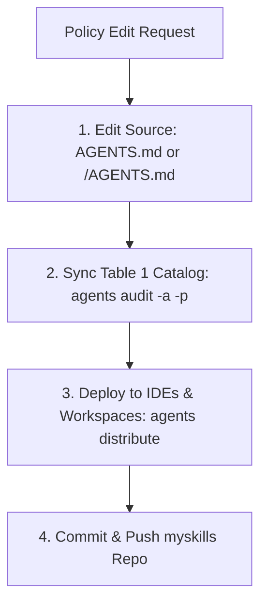

# Manage Global Policies

Author policies in the central `myskills/` catalog, then distribute them to active IDE global targets (`~/.gemini`, `~/.claude`, `~/.cursor`) and project workspaces.

## Workflow

## Core Rules

1. **Source-First**: ALWAYS edit policy files in `<myskills-root>/` directly. NEVER edit deployed destination copies in `~/.gemini/` or `.claude/` (they are overwritten during distribution).
2. **Policy Targets**:
   - Universal root policy: `<myskills-root>/AGENTS.md`
   - Platform delta overrides: `<myskills-root>/<platform>/AGENTS.md` (e.g. `gemini/AGENTS.md`)
3. **Lookup & Inspection**:
   - Locate target paths: `agents info policy.general` or `agents info policy.<platform>`.
   - Print raw subdoc content: `agents read policy.<subdocname>`.
4. **Distribution & Audit**:
   - Run `agents audit -a -p` to sync Table 1 skill catalogs in `AGENTS.md`.
   - Run `agents distribute` to deploy policy deltas across all IDE home configs and project workspaces.
