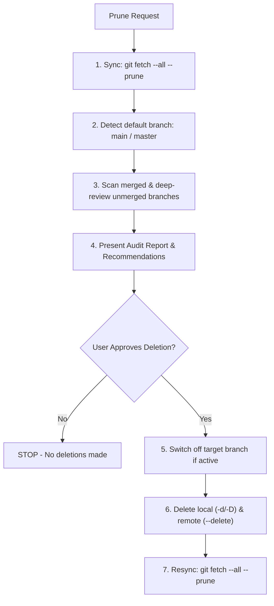

# Prune Branches

Audit-first branch pruning. ALWAYS report findings and await explicit user approval before deleting branches.

## Workflow

## Branch Classification Heuristics

| Category | Detection Command / Condition | Action / Recommendation |
| :--- | :--- | :--- |
| **Directly Merged** | `git branch --merged <default>` / `git branch -r --merged origin/<default>` | Mark safe to delete |
| **Squash-Merged** | `git diff origin/<default>...origin/<branch> --stat` is empty (`0 insertions, 0 deletions`), OR `git cherry` returns `-` | Mark safe to delete (Squash-merged) |
| **Unmerged Active** | `git cherry` returns `+` and tree diff has changes | Recommend: 1. PR & Merge, 2. Cherry-pick, or 3. Abandon |

## Execution Protocol

### 1. Audit (Read-Only)
1. **Detect Default Branch**: `git symbolic-ref refs/remotes/origin/HEAD` (fallback to `main`).
2. **Sync Tracking Refs**: `git fetch --all --prune`.
3. **Audit Branches**: Run merged commands and deep-review unmerged branches against the table above.
4. **Report & Await Approval**: Output categorized branch lists (Directly Merged, Squash-Merged, Active Unmerged). STOP and await explicit user confirmation.

### 2. Prune (Post-Approval Only)
1. **Active Branch Guard**: If current branch is targeted for deletion, switch first: `git checkout <default>`.
2. **Delete Local**: `git branch -d <branch>` (use `-D` only for confirmed squash-merged branches).
3. **Delete Remote**: `git push origin --delete <branch1> <branch2> ...`
4. **Resync Tracking Cache**: `git fetch --all --prune`.
