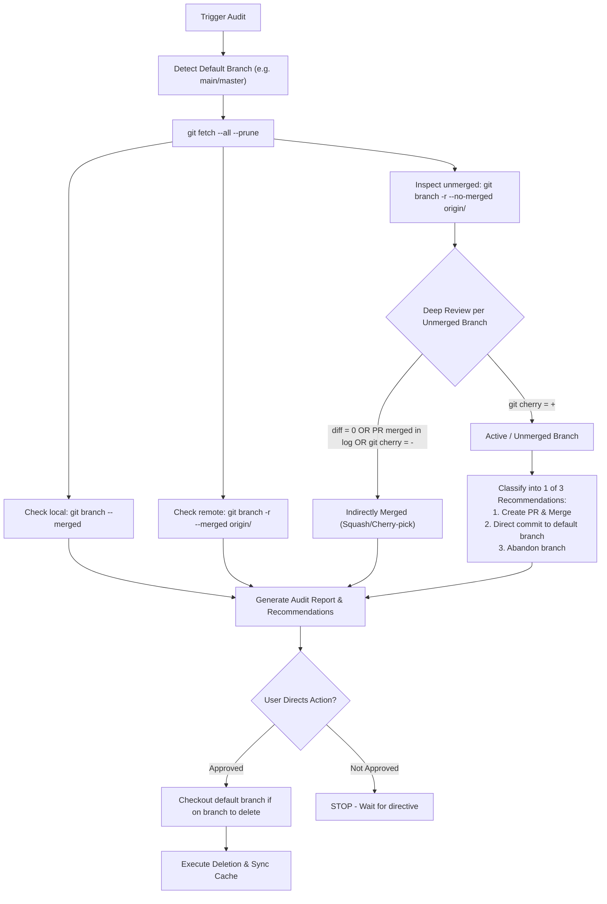

# Pruning Stale Git Branches

Perform an audit-first review of local and remote branches. Do NOT delete any branch until the user explicitly approves the audit report.

## Workflows

## Step-by-Step Execution

### Phase 1: Audit & Classification (Strict Read-Only)

1. **Detect Default Branch**: Resolve target default branch (`DEFAULT_BRANCH`):
   - Query remote HEAD: `git symbolic-ref refs/remotes/origin/HEAD` (e.g. `main` or `master`). If unresolved, check current branch or fallback to `main`.
2. **Sync Tracking Refs**: Run `git fetch --all --prune`.
3. **Find Directly Merged Branches**:
   - Local: `git branch --merged <DEFAULT_BRANCH>`
   - Remote: `git branch -r --merged origin/<DEFAULT_BRANCH>`
4. **Deep Review Unmerged Branches**: For each branch in `git branch -r --no-merged origin/<DEFAULT_BRANCH>`:
   - Check patch equivalence: `git cherry origin/<DEFAULT_BRANCH> origin/<branch>`
   - Check 3-dot diff: `git diff origin/<DEFAULT_BRANCH>...origin/<branch> --stat`
   - **Squash-Merge & Rebase Audit**:
     1. **Tree Diff Check**: If 3-dot diff shows `0 insertions(+), 0 deletions(-)`, all changes are already incorporated into `<DEFAULT_BRANCH>` via squash-merge or rebase.
     2. **PR / Commit Log Grep**: Check if the branch name or associated PR number appears in `<DEFAULT_BRANCH>` history:
        `git log origin/<DEFAULT_BRANCH> --grep="<branch-name>" --oneline` or `git log origin/<DEFAULT_BRANCH> --grep="(#<PR_NUMBER>)" --oneline`.
     3. **Patch Equality**: If `git cherry` returns `-` for all commits on the branch, commits were cherry-picked/rebased.
   - **Classification Rules**:
     - **Indirectly Merged (Safe to prune)**: 3-dot diff is empty (`0 insertions, 0 deletions`), PR/branch mention found in squash merge commit message, or `git cherry` returns `-`.
     - **Unmerged Active**: `git cherry` returns `+` and changes are absent from `<DEFAULT_BRANCH>`. Assess changes and assign 1 of 3 recommendations:
       1. *Create PR & Merge*: Large feature/fix needing code review.
       2. *Direct Commit to default branch*: Small doc/config tweak safe for direct cherry-pick.
       3. *Abandon Branch*: Hardcoded secrets, obsolete code, or rejected draft.

### Phase 2: Report & Pause

Present a structured report containing:
1. **Local & Direct Remote Merged Branches** (Safe to prune).
2. **Indirectly Merged Branches** (Safe to prune with rationale).
3. **Unmerged Branches & Recommendations** (Categorized with 1/2/3 options).

> [!IMPORTANT]
> **Audit-First Guardrail**: STOP and wait for the user's explicit directive before executing any deletion (`git branch -d`/`-D` or `git push origin --delete`).

### Phase 3: Prune (Upon Explicit Directive)

1. **Active Branch Switch Guard**: Check current branch via `git branch --show-current`. If currently on a branch targeted for deletion, switch first: `git checkout <DEFAULT_BRANCH>`.
2. **Delete Local Branches**: `git branch -d <branch>` (or `-D` if squash-merged).
3. **Delete Remote Branches**: `git push origin --delete <branch_1> <branch_2> ...`
4. **Sync Local Tracking Cache**: `git fetch --all --prune`.
