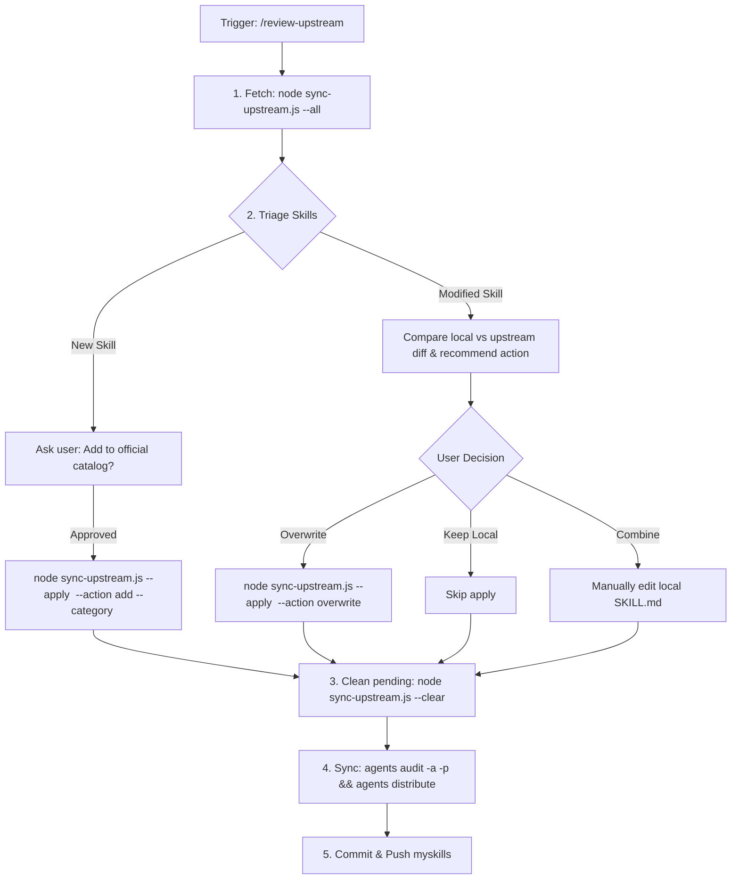

# Review Upstream Skills

Fetch, diff, and reconcile custom skill updates from upstream source repositories into `myskills/`.

## Workflow

## CLI Reference

| Action | Command |
| :--- | :--- |
| **Fetch all upstream** | `node sync-upstream.js --all` |
| **Apply new skill** | `node sync-upstream.js --apply <skill_name> --action add --category <category>` |
| **Overwrite local skill** | `node sync-upstream.js --apply <skill_name> --action overwrite` |
| **Clear pending queue** | `node sync-upstream.js --clear` |
| **Audit & Distribute** | `agents audit -a -p && agents distribute` |

## Triage Rules for Modified Skills

For each modified skill, report to the user:
1. **Summary of differences**: What upstream added vs. what local customized.
2. **Recommendation**: State clearly whether to overwrite, keep local, or merge.
3. **Options**:
   - `a. Keep local` (reject upstream changes)
   - `b. Overwrite` (accept upstream version)
   - `c. Merge` (manually combine complementary improvements)
