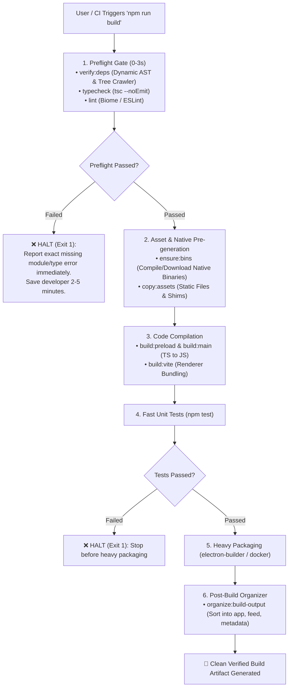

# Set Up Package Scripts

Configure, harden, and structure npm/pnpm package scripts with fail-fast preflight gates, deterministic asset pipelines, and clean lifecycle boundaries.

---

## Directives

1. **Fail-Fast Gating**: Heavy build commands (`build`, `build:linux`, `build:win`, `release`) MUST chain lightweight verification steps FIRST (`verify:deps`, `typecheck`, `lint`) before invoking heavy packagers or compilers.
2. **Deterministic Script Hierarchy**: Group package scripts using standard namespace prefixes (`build:*`, `test:*`, `verify:*`, `ensure:*`, `sync:*`, `clean:*`).
3. **Cross-Platform Resilience**: Package scripts MUST run identically on Windows (cmd/PowerShell), macOS (zsh), Linux (bash), and CI/Docker environments without machine-specific absolute paths.
4. **Zero Silent Failures**: Verification scripts MUST exit with code `1` (`process.exit(1)`) on any unresolved dependency or assertion failure to immediately halt downstream build steps.
5. **No Secret Mutation in CI**: Verification commands (`verify:deps`) MUST be read-only auditors. Auto-mutating tools (`sync:deps`, `lint:fix`, `format`) MUST be separated into dedicated commands.

---

## Canonical Script Taxonomy

```json
{
  "scripts": {
    "// PREFLIGHT & AUDITING": "",
    "verify:deps": "node scripts/verify-packaged-dependencies.js",
    "sync:deps": "node scripts/verify-packaged-dependencies.js --fix",
    "typecheck": "tsc --noEmit",
    "lint": "biome check src",
    "lint:fix": "biome check --write src",
    "check": "npm run verify:deps && npm run typecheck && npm run test",

    "// COMPILATION & ASSETS": "",
    "ensure:bins": "node scripts/ensure-binaries.js",
    "copy:assets": "copyfiles -u 1 \"src/assets/**/*\" dist",
    "build:preload": "tsup src/preload.ts --out-dir dist --format cjs --external electron",
    "build:main": "tsc -p tsconfig.main.json",
    "build:vite": "vite build",

    "// PACKAGING & ARTIFACTS (FAIL-FAST)": "",
    "organize:build-output": "node scripts/organize-build-output.js",
    "build": "npm run check && npm run ensure:bins && npm run build:preload && npm run build:main && npm run copy:assets && npm run build:vite && electron-builder --win && npm run organize:build-output",
    "build:linux": "npm run check && npm run ensure:bins && npm run build:preload && npm run build:main && npm run copy:assets && npm run build:vite && electron-builder --linux && npm run organize:build-output",
    "build:fast": "npm run verify:deps && npm run build:preload && npm run build:main && npm run copy:assets && npm run build:vite && electron-builder --dir && npm run organize:build-output",

    "// MAINTENANCE & CLEANUP": "",
    "clean": "node scripts/clean.js",
    "clean:all": "node scripts/clean.js --all"
  }
}
```

---

## Workflow



---

## Subdoc References

- **Script Catalog & Repertoire**: see [REFERENCE.md](REFERENCE.md) for detailed descriptions, failure modes, and implementation templates for essential developer scripts.
- **Dependency Crawler Architecture**: see [REFERENCE.md](REFERENCE.md#dependency-verifier-crawler) for AST require extraction and transitive dependency verification.
