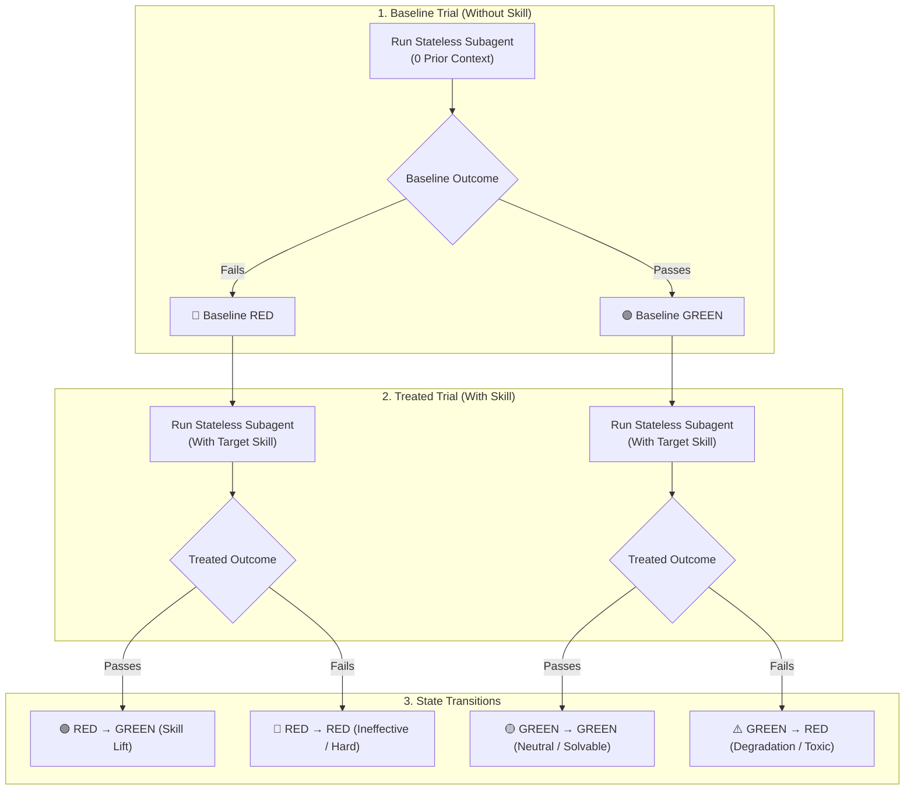
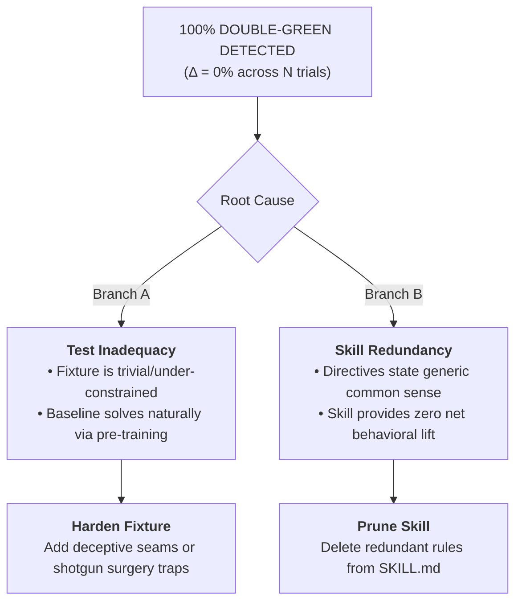

# Reference: Skill TDD Framework & Failure Taxonomy

---

## 1. 4-Axis Skill Test Coverage

| Coverage Axis | Invariant & Pass Criteria |
| :--- | :--- |
| **1. Directive Coverage** | Every core `MUST`/`NEVER` rule is verified by $\ge 1$ test assertion. |
| **2. Decision Branch Coverage** | Every flowchart branch is triggered (requires $\ge 1$ Negative and $\ge 1$ Positive fixture). |
| **3. Anti-Pattern Coverage** | Every failure mode in Section 6 is targeted by a negative fixture. |
| **4. Domain Diversity** | Test suite spans $\ge 2\text{--}3$ distinct domains (E-commerce, Cloud, Analytics, Game). |

---

## 2. Test Matrix Budget & Thresholds

| Evaluation Tier | Matrix Budget ($M = N_{\text{tests}} \times N_{\text{runs}}$) | Purpose & Graduation Gate |
| :--- | :---: | :--- |
| **Tier 1: Fast Dev Loop** | $N_{\text{tests}} \ge 2$, $N_{\text{runs}} \in [1, 3]$/test | Smoke test for rapid hypothesis iteration. |
| **Tier 2: Graduation Gate** | $N_{\text{tests}} \ge 3\text{--}4$, $N_{\text{runs}} \ge 5\text{--}10$/test | Production release validation across all 4 axes. |

### Graduation Formula:
```text
Delta_Suite = (1 / N_neg) * sum((n_RedToGreen - n_GreenToRed) / N_runs) >= +60%
```
- **Positive Clearance Rate**: 100% (Zero False Positives on Positive Fixtures).
- **Anti-Cheat Audit**: 100% PASS (Zero spec leaks or prompt tampering).

---

## 3. Single-Call Parallel Matrix Dispatch Protocol

To eliminate sequential latency, MUST launch all test trials in a **single parallel batch**:

```python
# Example: Parallel Batch Dispatch (6 trials concurrently in 1 turn)
invoke_subagent(
    Subagents=[
        # Fixture 1: Baseline & Treated Runs
        {"TypeName": "plain_assistant", "Role": "Baseline | Checkout | Run 1", "Prompt": "<verbatim_prompt>"},
        {"TypeName": "self", "Role": "Treated | Checkout | Run 1", "Prompt": "<verbatim_prompt>"},
        # Fixture 2: Baseline & Treated Runs
        {"TypeName": "plain_assistant", "Role": "Baseline | Exporter | Run 1", "Prompt": "<verbatim_prompt>"},
        {"TypeName": "self", "Role": "Treated | Exporter | Run 1", "Prompt": "<verbatim_prompt>"},
        # Positive Check: Baseline & Treated
        {"TypeName": "plain_assistant", "Role": "Baseline | VaultAlt | Positive", "Prompt": "<verbatim_prompt>"},
        {"TypeName": "self", "Role": "Treated | VaultAlt | Positive", "Prompt": "<verbatim_prompt>"},
    ]
)
```

---

## 4. Multi-Trial State Transitions



```text
Delta = (n_RedToGreen - n_GreenToRed) / N_Total
```

---

## 5. Decoupled Sandbox & Spec Architecture

Isolate test specifications from source code fixtures to eliminate spec snooping:

```
.scratch/
├── <skill>-versions/
│   ├── HYPOTHESIS.md                 <── Append-only ledger (NEVER delete entries)
│   ├── SKILL.v0.md                   <── Baseline original
│   ├── SKILL.v1.md                   <── Candidate mutation v1
│   └── specs/                        <── ISOLATED TEST SPECS (Hidden from subagents)
│       ├── fixture_1.spec.md
│       ├── fixture_2.spec.md
│       └── fixture_pos.spec.md
└── fixtures/                         <── PURE SOURCE CODE ONLY
    ├── checkout_system/              <── Zero spec / zero markdown / zero hint files
    ├── report_exporter/
    └── audit_vault/
```

### `HYPOTHESIS.md` Entry Schema

```markdown
---
## [v<n>] YYYY-MM-DD - <Summary of Mutation>

### 1. Hypothesis
- **Defect in v<n-1>**: [Observed failure mode]
- **Mutation in v<n>**: [Specific directive/rule added]
- **Target Lift**: `Δ_Suite >= +60%`

### 2. Multi-Domain Test Suite Coverage Matrix ($M = N_{\text{tests}} \times N_{\text{runs}}$)

| Test Fixture | Domain | Target Anti-Pattern | Baseline ($N=<runs>$) | Treated ($N=<runs>$) | $\Delta_i$ | Status |
| :--- | :--- | :--- | :---: | :---: | :---: | :---: |
| **1. `<fixture-1>`** | E-commerce | God Method | $0/N$ GREEN | $N/N$ GREEN | **+100%** | 🟢 PASS |
| **2. `<fixture-2>`** | Analytics | Shallow Pass-through | $0/N$ GREEN | $(N-1)/N$ GREEN | **+80%** | 🟢 PASS |
| **3. `<fixture-3>`** | Cloud Storage | Missing Adapter Seam | $0/N$ GREEN | $N/N$ GREEN | **+100%** | 🟢 PASS |
| **4. `<fixture-pos>`**| Security | Clean Deep Module | $N/N$ GREEN | $N/N$ GREEN | **0% (Pass)** | 🟢 NO FALSE POS |

- **Average Suite Uplift**: `Δ_Suite = +<score>%`

### 3. Verdict
- [ ] ❌ **INVALIDATED**: $\Delta_{\text{Suite}} \le 0$. Discard $v<n>$.
- [ ] 🟡 **PARTIAL**: $\Delta_{\text{Suite}} > 0$ but $< +60\%$. Draft $v<n+1>$.
- [ ] 🎯 **GRADUATED**: $\Delta_{\text{Suite}} \ge +60\%$ + 100% Positive Clearance. Promote to production.

### 4. Lessons Learned
- [Key takeaways to prevent cyclic regressions]
```

---

## 6. Failure Modes Taxonomy

| Failure Mode | Condition | Root Cause | Action |
| :--- | :--- | :--- | :--- |
| **1. Spec Snooping** | Subagent reads `TEST_SPEC.md` or repo skills | Spec files co-located in fixture directory. | **FATAL FAILURE**: Abort run; relocate specs to `specs/`. |
| **2. Zero-Delta Anomaly** | 100% `GREEN -> GREEN` ($\Delta = 0$) | Test is trivial (Branch A) OR skill is dead weight (Branch B). | Harden test fixture (A) or prune skill rules (B). |
| **3. Ineffective Skill** | High `RED -> RED` ($\Delta_{\text{Suite}} \le +10\%$) | Directives are too vague or lack tool constraints. | Invalidate in `HYPOTHESIS.md`, add rigid directives in $v_{n+1}$. |
| **4. Toxic Degradation** | `GREEN -> RED` $> 0$ ($\Delta_{\text{Suite}} < 0$) | Directives conflict with policies or add confusion. | Invalidate in `HYPOTHESIS.md`, remove contradictory rules. |
| **5. Hyper-Critique** | Positive Fixture fails | Skill rejects clean code (false positive). | Relax rigid thresholds; add explicit clearance criteria. |
| **6. Overfitting Cheats** | Lexical leak or prompt tampering | Prompt leaks hints or skill hardcodes test words. | **FATAL FAILURE**: Abort run; enforce verbatim `TEST_SPEC.md`. |

---

## 7. Zero-Delta Diagnosis Tree



---

## 8. Zero-Prior-Context Execution Invariant

1. **Stateless Subagents**: Every trial MUST spawn a new subagent instance with 0 prior conversation memory.
2. **Sandbox Isolation**: Test mutations against `.scratch/<skill>-versions/SKILL.v<n>.md`.
3. **Verbatim Transmission**: Prompts MUST be transmitted verbatim from `TEST_SPEC.md`.

---

## 9. Overfitting & Anti-Snooping Detection Protocol

### Automated Transcript Snooping Scan
```bash
# Verify no subagent accessed isolated specs or repository skills during trial
grep -E '("specs/|/SKILL\.md|/REFERENCE\.md)' <appDataDir>/brain/<subagent-id>/.system_generated/logs/transcript.jsonl
```

### Abort Output Format
```markdown
❌ Overfitting cheat detected:
- Reason: [Prompt tampered with hints / Subagent snooped evaluation spec or repository skill: '<file_path>']
- Action: Test trial aborted and invalidated. Isolate specs to .scratch/<skill>-versions/specs/ and rerun.
```
