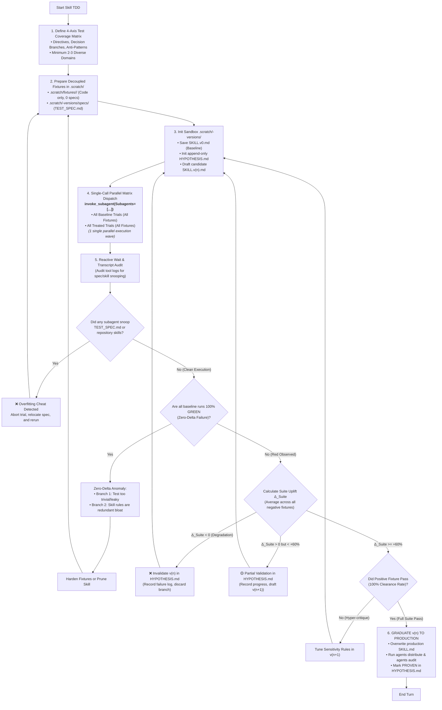

# Skill TDD

Test and benchmark skills (`SKILL.md`), subdocs, and policies (`AGENTS.md`) using red-green-regression cycles, 4-axis coverage, single-call parallel dispatch, and hypothesis ledgers.

## Directives

1. **Red Baseline First**: MUST run a baseline subagent without the skill on negative fixtures to verify failure (Red) before testing candidate versions.
2. **Double-Sided Fixtures**: MUST test both a **Negative Fixture** (agent must block/refactor) and a **Positive Fixture** (agent must clear/approve) to prevent false-positive hyper-critique.
3. **4-Axis Coverage**: Test suites MUST cover *Directives*, *Decision Branches*, *Anti-Patterns*, and *Domain Diversity* (minimum 2–3 distinct domains) per [REFERENCE.md](REFERENCE.md).
4. **Test Matrix Budget**:
   - **Fast Dev Loop**: $N_{\text{tests}} \ge 2$, $N_{\text{runs}} \in [1, 3]$ per test.
   - **Graduation Gate**: $N_{\text{tests}} \ge 3\text{--}4$ diverse domain fixtures, $N_{\text{runs}} \ge 5\text{--}10$ with fresh 0-prior-context subagents.
   - **Graduation Criteria**: $\Delta_{\text{Suite}} \ge +60\%$, 100% positive clearance, and 0 cheat flags.
5. **Single-Call Parallel Matrix Dispatch**: MUST launch all independent test trials (baseline and treated runs across all fixtures) in a **single concurrent batch** via `invoke_subagent(Subagents=[...])`. NEVER dispatch trials sequentially across multiple turns. Tag each subagent clearly: `Role: "[Baseline/Treated] | <Fixture> | Run <K>"`.
6. **Spec Decoupling & Anti-Snooping Audit**:
   - `TEST_SPEC.md` and `HYPOTHESIS.md` MUST reside in `.scratch/<skill>-versions/specs/` and NEVER inside fixture code directories (`.scratch/fixtures/<name>/`).
   - Evaluators MUST inspect subagent tool calls in transcripts. If a baseline subagent reads repository `SKILL.md` files or ANY subagent reads `TEST_SPEC.md`/`HYPOTHESIS.md`, abort immediately with:  
     `Overfitting cheat detected: Subagent snooped <path>`.
7. **Immutable Prompt Contract**: MUST copy prompts *verbatim* from `TEST_SPEC.md`. NEVER inject hints, line numbers, or leading context.
8. **Zero Prior Context**: Spawn every test run using a fresh subagent with **0 prior context**. NEVER reuse subagent conversation threads.
9. **Sandbox Delta Versioning**:
   - NEVER edit production skills/policies directly on test failure.
   - Create a sandbox (`.scratch/<skill>-versions/`) with candidate files (`SKILL.v1.md`) and an append-only `HYPOTHESIS.md` (NEVER delete entries).
   - Point test subagents to candidate versions. Graduate to production only after meeting the $\Delta_{\text{Suite}}$ threshold.
10. **Anti-Overfitting Cheats**:
    - `SKILL.md` and `REFERENCE.md` MUST express domain-agnostic rules. NEVER hardcode test fixture entities, class names, or mock values.
    - Evaluators detecting leaked words or prompt hints MUST abort immediately with:  
      `Overfitting cheat detected: <reason>`.
11. **Zero-Delta Anomaly**: If 100% of runs yield Double-GREEN ($\Delta = 0$), classify as a **Zero-Delta Failure** (harden test fixture or prune redundant skill rules).
12. **Seam-Only Assertions**: Verify behavior at public seams (verdict, scorecard rows, tool call constraints, stop boundary). NEVER assert on private reasoning traces.

---

## Anti-Patterns Reference Matrix

| Anti-Pattern | Description & Failure Mode | Detection & Fix |
| :--- | :--- | :--- |
| **Spec Snooping / Leaks** | Subagent discovers and reads `TEST_SPEC.md` or repository skills during exploration. | **FATAL FAILURE**. Isolate specs to `.scratch/<skill>-versions/specs/`; abort if tool log shows snooping. |
| **Sequential Waterfall Dispatch** | Spawning subagents sequentially across multiple turns, wasting 10–15 minutes of idle waiting. | **FATAL WORKFLOW VIOLATION**. Launch entire evaluation matrix in 1 parallel `invoke_subagent` batch. |
| **Single-Test Bias** | Testing only 1 fixture without multi-domain coverage. | Enforce $M = N_{\text{tests}} \times N_{\text{runs}}$ matrix across $\ge 2\text{--}3$ distinct domains. |
| **Production Overwrite** | Mutating production `SKILL.md` directly during experimentation. | Use `.scratch/<skill>-versions/` with candidate files (`v1`, `v2`) and append-only `HYPOTHESIS.md`. |
| **Overfitting Cheats** | Hardcoding test names in `SKILL.md` or leaking hints in prompts. | **FATAL FAILURE**. Strip domain keywords from skill; enforce verbatim prompt from `TEST_SPEC.md`. |
| **Zero-Delta Anomaly** | Baseline passes 100% without the skill ($\Delta = 0$). | Harden test fixture (Branch 1) or prune redundant rules from skill (Branch 2). |
| **Tautological Prompts** | Prompts containing the solution within the question. | Use neutral, naive user prompts. |
| **Implementation-Coupled Evals** | Asserting on internal thoughts rather than tool calls/seams. | Assert strictly on public seams: Decision Verdict, Scorecard, Links, Stop Boundary. |
| **Single-Sided Testing** | Testing only negative cases, rejecting valid code. | Always run the Positive Fixture check; skill must grant clearance when code is clean. |

---

## Workflow



---

## Output Template: Skill Evaluation Report

```markdown
# 🧪 Skill TDD Evaluation Report: [<skill-name>]

> **Target:** `<category>/<skill-name>/SKILL.md`  
> **Matrix:** $M = N_{\text{tests}} \times N_{\text{runs}} = <total\_trials>$ (Parallel Batch Dispatch) | **Version:** `v<n>`  

### 1. Test Suite Coverage & Matrix Results

| Test Fixture | Domain | Target Seam / Anti-Pattern | Baseline ($N=<runs>$) | Treated ($N=<runs>$) | $\Delta_i$ | Status |
| :--- | :--- | :--- | :---: | :---: | :---: | :---: |
| **1. `<fixture-1>`** | E-commerce | God Method / Missing Seam | $0/N$ GREEN | $N/N$ GREEN | **+100%** | 🟢 PASS |
| **2. `<fixture-2>`** | Analytics | Shallow Pass-through / False Seam | $0/N$ GREEN | $(N-1)/N$ GREEN | **+80%** | 🟢 PASS |
| **3. `<fixture-3>`** | Cloud Storage | Hardcoded Concrete Transport | $0/N$ GREEN | $N/N$ GREEN | **+100%** | 🟢 PASS |
| **4. `<fixture-pos>`**| Security | Clean Deep Module (Positive Check) | $N/N$ GREEN | $N/N$ GREEN | **0% (Pass)** | 🟢 NO FALSE POS |

- **Average Suite Uplift**: $\Delta_{\text{Suite}} = \frac{1}{N_{\text{neg}}} \sum \Delta_i = \mathbf{+<score>\%}$.

### 2. Overfitting & Anti-Cheat Audit
- [x] All test specs isolated to `.scratch/<skill>-versions/specs/` (zero specs in fixture directories).
- [x] Transcripts audited: 0 subagents snooped `TEST_SPEC.md` or repository skills.
- [x] Test prompts sent to subagents were 100% verbatim from `TEST_SPEC.md`.
- [x] `SKILL.md` and `REFERENCE.md` contain zero domain keywords from fixtures.
- [x] Subagents dispatched in parallel with 0 prior context in isolated sandboxes.

### 3. Hypothesis & Graduation Verdict
- **Active Hypothesis:** [Summary from `HYPOTHESIS.md`]
- **Hypothesis Verdict:** `VALIDATED` | **Status:** `🎯 GRADUATED TO PRODUCTION`
```

---

## Subdoc Reference

- see [REFERENCE.md](REFERENCE.md).
