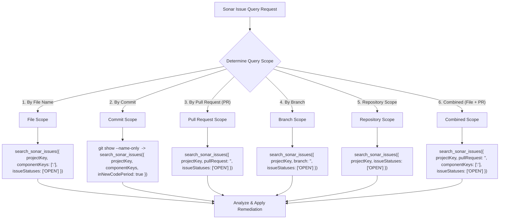
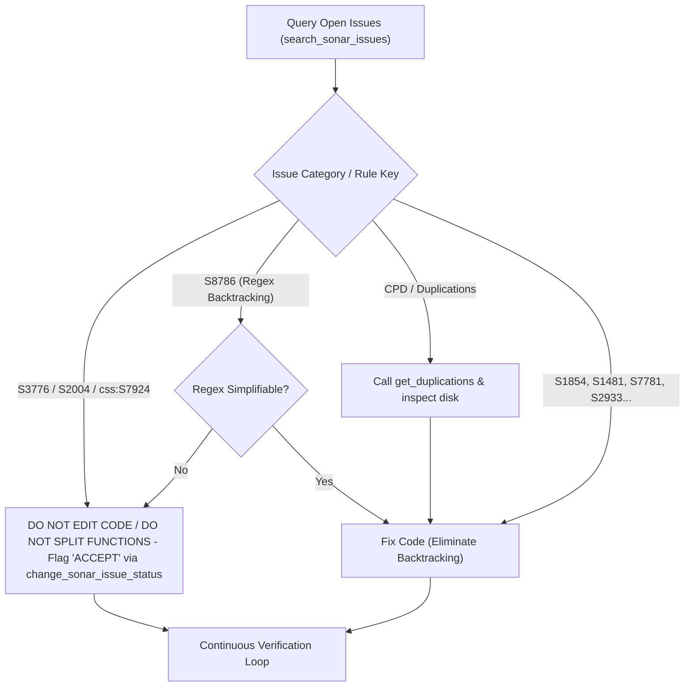
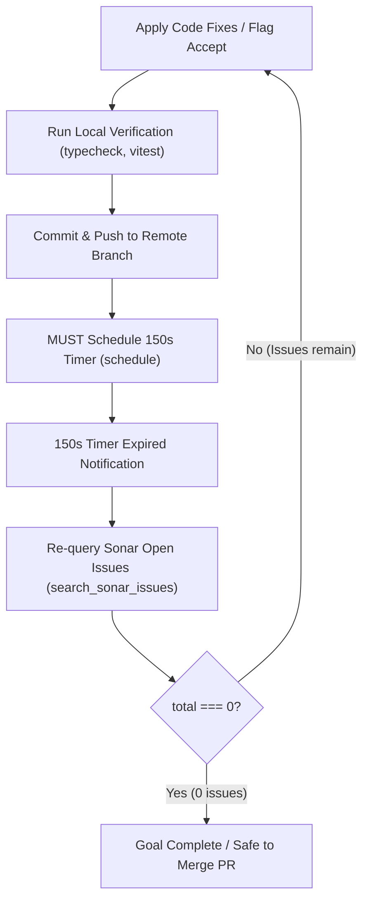

# Sonar Remediation & Quality Gate Workflows

Inspect, remediate, accept, and automate SonarQube/SonarCloud code quality issues across single files, PRs, or entire repositories. (Works with `sonarcloud:` and `sonarqube:` MCP servers).

## Workflows

### 1. Issue Query Scope Flowchart

> [!IMPORTANT]
> When analyzing an active PR, MUST pass `pullRequestId` or `pullRequest`. Omitting PR ID queries the default branch (`main`).
> See [REFERENCE.md](REFERENCE.md) for full MCP Tool Parameter Reference & Argument Schemas.

### 2. Issue Triage & Action Decision Flowchart

> [!IMPORTANT]
> Before calling `change_sonar_issue_status` to flag any issue as `"accept"` or `"falsepositive"`, MUST search for the issue key using `search_sonar_issues` with `issueStatuses: ["OPEN"]`.
> See [REFERENCE.md](REFERENCE.md) for Detailed Rule Remediation & Triage Matrix.

### 3. Remediation Safety Boundaries

- **NEVER delete, rename, or move** standalone entrypoints, child processes, worker scripts, or dynamic IPC/service wrappers.
- **NEVER modify** exported module interfaces, public API signatures, or database schemas during Sonar Remediation.
- **Domain Contract Preservation (`S1854`, `S1481`)**: NEVER alter returned object keys or state properties (e.g. `favorite`, `id`, `status`) to consume an unused variable. Safely delete the dead variable calculation instead.

### 4. Continuous Zero-Issue & Remote CI Verification Flowchart

### 5. Script-Automated Task Execution

For large backlogs, run companion scripts in `.agents/skills/sonar-remediation/scripts/`: `count_issues.py`, `generate_plan.py` (`request_feedback: true`), `generate_task.py` (`user_facing: true`).
**Task Execution Loop**: Fix branch -> For each file in `task.md`: Mark `[/]` -> Patch via `patch_file` -> Mark `[x]` -> Verify via project build/test tools before committing.

---

## Detailed Rules & Code Examples

See [REFERENCE.md](REFERENCE.md) for Preemptive Code Inspection, domain-scoped **Before / After** code examples, MCP argument schemas, and specific rule remediation patterns. (MUST read [REFERENCE.md](REFERENCE.md) before applying code fixes).
