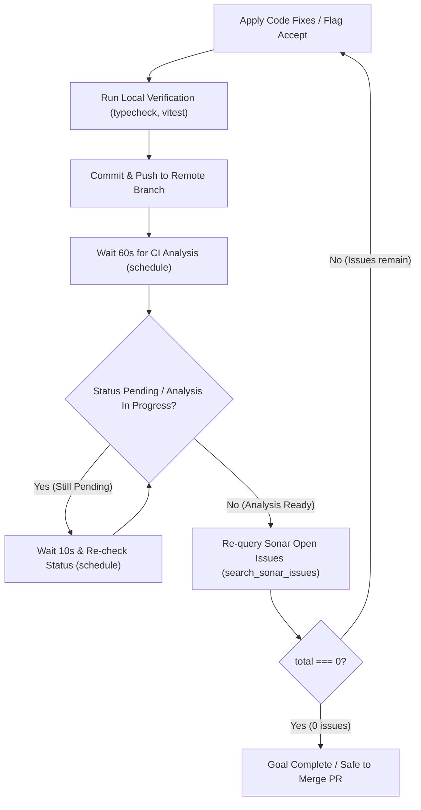

# Sonar Remediation & Quality Gate Workflows

Inspect, remediate, accept, and automate SonarQube/SonarCloud code quality issues across single files, PRs, or entire repositories (supports `sonarcloud:` and `sonarqube:` MCP servers).

## Directives

1. **Safety Boundaries**: NEVER delete, rename, or move standalone entrypoints, child processes, worker scripts, or dynamic IPC/service handlers.
2. **Preserve Public Signatures**: NEVER modify exported module interfaces, public API signatures, or database schemas during Sonar remediation.
3. **Domain Contract Preservation (`S1854`, `S1481`)**: NEVER alter returned object keys or state properties (e.g. `favorite`, `id`, `status`) to consume an unused variable. Safely delete the dead variable calculation instead.
4. **Issue Verification Before Status Change**: Before calling `change_sonar_issue_status` to flag `"accept"` or `"falsepositive"`, MUST search the issue key using `search_sonar_issues` with `issueStatuses: ["OPEN"]`.
5. **PR Scope Parameter**: When analyzing an active PR, MUST pass `pullRequestId` or `pullRequest`. Omitting PR ID queries the default branch.

---

## Query Scope Decision Matrix

| Scope | MCP Query Call |
| :--- | :--- |
| **File** | `search_sonar_issues({ projectKey, componentKeys: ['<projectKey>:<filePath>'], issueStatuses: ['OPEN'] })` |
| **Commit** | `git show --name-only <hash>` $\rightarrow$ `search_sonar_issues({ projectKey, componentKeys, inNewCodePeriod: true })` |
| **Pull Request (PR)** | `search_sonar_issues({ projectKey, pullRequest: '<pr_id>', issueStatuses: ['OPEN'] })` |
| **Branch** | `search_sonar_issues({ projectKey, branch: '<branch_name>', issueStatuses: ['OPEN'] })` |
| **Repository** | `search_sonar_issues({ projectKey, issueStatuses: ['OPEN'] })` |
| **File + PR** | `search_sonar_issues({ projectKey, pullRequest: '<pr_id>', componentKeys: ['<projectKey>:<filePath>'], issueStatuses: ['OPEN'] })` |

---

## Issue Triage & Remediation Matrix

| Issue Category / Rule Key | Action | Requirements & Protocol |
| :--- | :--- | :--- |
| **Cognitive Complexity (`S3776`)** | **Flag `accept`** | NEVER split functions solely for S3776. Structural splits require `/improve-codebase-architecture`. |
| **Deep Nesting (`S2004`)** | **Flag `accept`** | Deep nesting in UI/event/search closures is intentional design. |
| **Theme Contrast (`css:S7924`)** | **Flag `accept`** | Brand color palettes take precedence over automated WCAG checks. |
| **Regex Backtracking (`S8786`)** | **Fix or Flag `accept`** | Simplify regex if possible; flag `accept` if regex is already minimal. |
| **Duplications (CPD)** | **Fix code** | Call `get_duplications`, inspect disk, consolidate duplicated blocks into shared helpers. |
| **Language Smells (`S1854`, `S1481`, etc.)** | **Fix code** | Follow domain-specific patterns in [REFERENCE.md](REFERENCE.md). |

---

## Continuous CI Verification Loop

---

## Automation Scripts (Large Backlogs)

For batch fixes across large repositories, run helper scripts in `.agents/skills/sonar-remediation/scripts/`:
- `count_issues.py`: Aggregate issues by rule and component.
- `generate_plan.py`: Generate structured remediation plan (`request_feedback: true`).
- `generate_task.py`: Generate atomic task files (`user_facing: true`).

---

## Subdoc Reference

- **Rule Cookbook, Code Examples & Argument Schemas**: see [REFERENCE.md](REFERENCE.md).
