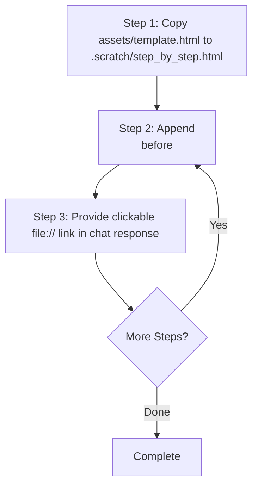

# Step-by-Step Visual Reference & Snippet Catalog

Quick reference for generating and appending Visual Primitives to `.scratch/step_by_step.html`.

---

## Workflow



---

## Base Step Card Wrapper

Wrap every new explanation step in this container before inserting above `<!-- NEXT_STEP_ANCHOR -->`:

```html
<article class="step-card">
  <div class="step-header">
    <span class="step-number">1</span>
    <h2 class="step-title">Step Title in Plain English</h2>
  </div>
  <div class="analogy-pill">Analogy: Like sending a sealed envelope through the post office</div>
  <p class="step-content">Brief 1-2 sentence core concept explanation.</p>

  <!-- INSERT VISUAL PRIMITIVE SNIPPET BELOW -->

</article>
```

---

## 5 Visual Primitive Snippets

### 1. Flow & Pipeline (Sequence, Request Lifecycle, Handshake)
```html
<div class="flow-row">
  <div class="flow-node highlight">
    <span>Browser / Client</span>
    <span class="node-sub">Port 443</span>
  </div>
  <div class="flow-arrow">HTTP Request →</div>
  <div class="flow-node">
    <span>API Gateway</span>
    <span class="node-sub">Load Balancer</span>
  </div>
  <div class="flow-arrow">gRPC →</div>
  <div class="flow-node">
    <span>Auth Service</span>
    <span class="node-sub">Verify Token</span>
  </div>
</div>
```

### 2. Architecture & Component Grid (Topology, Clustered Services)
```html
<div class="box-grid">
  <div class="comp-box">
    <div class="comp-header">
      <span class="comp-title">Ingress Controller</span>
      <span class="comp-badge">ROUTER</span>
    </div>
    <p class="comp-body">Terminates SSL and routes paths to internal services.</p>
  </div>
  <div class="comp-box">
    <div class="comp-header">
      <span class="comp-title">User Service</span>
      <span class="comp-badge">SERVICE</span>
    </div>
    <p class="comp-body">Handles profile CRUD and session persistence.</p>
  </div>
</div>
```

### 3. Memory & Packet Layout (Headers, Structs, Stack/Heap)
```html
<div class="mem-strip">
  <div class="mem-cell active" style="flex: 2">
    <span>Magic Header</span>
    <span class="cell-label">0x00 - 0x04</span>
  </div>
  <div class="mem-cell" style="flex: 3">
    <span>Metadata Flags</span>
    <span class="cell-label">0x04 - 0x0A</span>
  </div>
  <div class="mem-cell" style="flex: 5">
    <span>Data Payload</span>
    <span class="cell-label">0x0A - 0xFF</span>
  </div>
</div>
```

### 4. State Machine (Transitions, Lifecycles, Statuses)
```html
<div class="state-chain">
  <div class="state-badge">PENDING</div>
  <span class="flow-arrow">→</span>
  <div class="state-badge active">PROCESSING</div>
  <span class="flow-arrow">→</span>
  <div class="state-badge success">COMPLETED</div>
</div>
```

### 5. Interactive Tabs & Sub-view Controls (Deep-dive Exploration)
```html
<div class="interactive-panel">
  <div class="tab-bar">
    <button class="tab-btn active" data-tab="normal">Normal Path</button>
    <button class="tab-btn" data-tab="fallback">Fallback / Error</button>
  </div>
  <div class="tab-content active" data-tab-content="normal">
    <p>Server receives valid token and returns HTTP 200 OK immediately.</p>
  </div>
  <div class="tab-content" data-tab-content="fallback">
    <p>Token expired: Server rejects with HTTP 401 and triggers refresh token flow.</p>
  </div>
</div>
```
