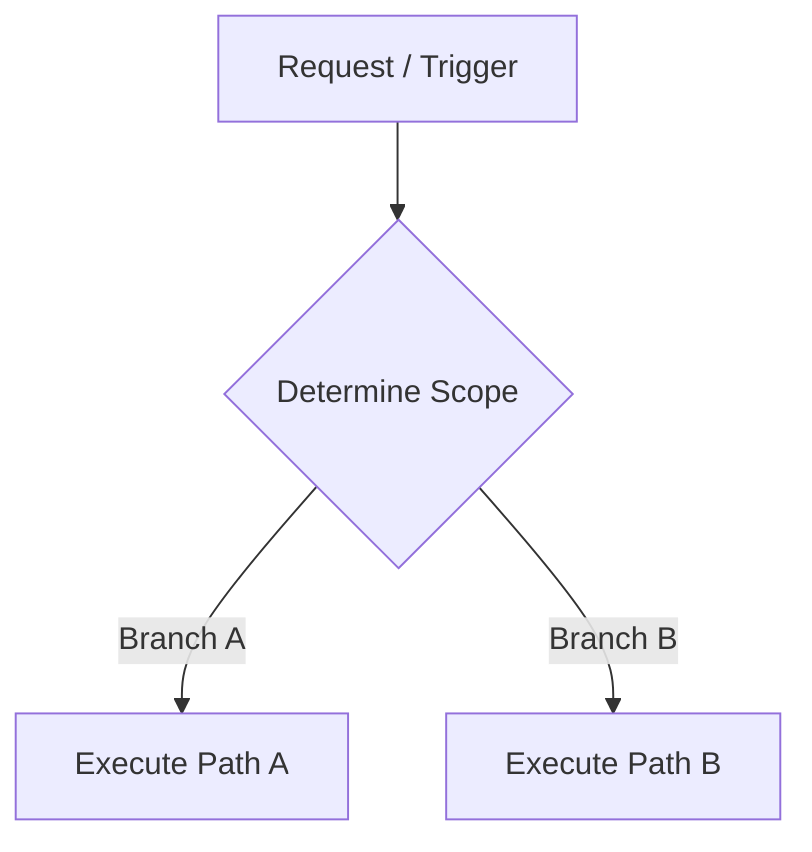

# Writing Skills

## Process

1. **Gather requirements**: Domain scope, specific use cases, scripts needed, reference materials.
2. **Draft skill**: SKILL.md instructions, Mermaid decision trees for multi-branch workflows, reference files based on complexity heuristics, utility scripts for deterministic tasks.
3. **Review with user**: Confirm use case coverage, clarity, and detail level.
4. **Distribute skill**: Sync across workspace targets using `agents --target <target-repo>` (or `agents --distribute`).

## Skill Structure

```
skill-name/
├── SKILL.md           # Main instructions (required)
├── REFERENCE.md       # Detailed docs (if needed)
├── EXAMPLES.md        # Usage examples (if needed)
└── scripts/           # Utility scripts (if needed)
    └── helper.js
```

## SKILL.md Template

````md
---
name: skill-name
description: Brief description of capability. Use when [specific triggers].
---

# Skill Name

## Quick start

[Minimal working example]

## Workflows



[Step-by-step processes with checklists for complex tasks]

## Advanced features

See [REFERENCE.md](REFERENCE.md) for advanced configuration and tool parameters.
````

## Description Requirements

Surfaced in system prompt. Max 1024 chars, third-person, format: `<Capability>. Use when [specific triggers].`

- **Good**: `Extract text/tables from PDF files. Use when working with PDF files or user mentions PDFs.`
- **Bad**: `Helps with documents.`

The bad example gives your agent no way to distinguish this from other document skills.

## Mermaid Decision Trees

- **When**: Workflows with 3+ branching paths or complex fallback loops. Do NOT use for simple flat 1-2-3 linear steps.
- **How**: Quote labels containing brackets/parens (`Node["Label (Details)"]`). Keep flowcharts under 25-30 lines.

## File Splitting & Scripts

- **Scripts**: Add when operation is deterministic (validation, formatting), same code would be generated repeatedly, or errors need explicit handling.
- **File Split**: Move content out of SKILL.md when primary or secondary indicators are triggered per [HEURISTICS.md](../writing-great-skills/HEURISTICS.md) — execute extraction via [write-skill-subdocs](../write-skill-subdocs/SKILL.md).

## Review Checklist

- [ ] Description includes explicit triggers ("Use when...")
- [ ] SKILL.md kept lean via complexity heuristics — see [HEURISTICS.md](../writing-great-skills/HEURISTICS.md)
- [ ] Mermaid decision tree used for workflows with 3+ branches
- [ ] No time-sensitive info
- [ ] Consistent terminology
- [ ] Concrete examples included
- [ ] References one level deep
- [ ] Skill distributed via `agents` CLI (`agents --distribute`)
- [ ] Policy coverage verified and auto-updated via `agents` CLI (`agents audit --add`)
