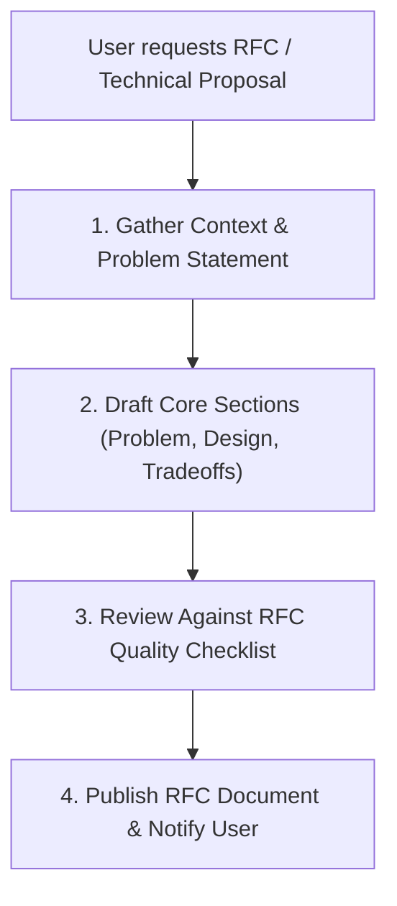

# Write an RFC (Request for Comments)

Guide the authoring of clear, actionable Request for Comments (RFC) proposals for software architecture changes, tool extensions, or technical workflow enhancements.

## Workflow



## Step 1: Gather Context & Problem Statement

1. **Identify the Core Need**: What exact problem, friction point, or missing capability triggers this RFC?
2. **Identify Impacted Components**: What files, modules, MCP tools, APIs, or user workflows are affected?
3. **Collect Concrete Case Studies**: Include real-world code snippets, logs, or stack traces demonstrating the issue.

## Step 2: RFC Document Layout (`RFC.md` / `rfc_*.md`)

Create or update the target RFC document using this standard structure:

```markdown
# RFC: [Descriptive Title]

**Author**: [Author Name / Agent]  
**Target Module / Tool**: [Target File / Component]  
**Status**: Proposal / Review / Approved  
**Date**: [YYYY-MM-DD]  

---

## Executive Summary
A concise 2-3 sentence overview of the proposed change and its primary benefit.

## 1. Problem Statement
- Describe the current pain point or technical limitation.
- Include concrete code examples, error tracebacks, or workflow friction points.
- Highlight the cost of NOT solving this problem (latency, token waste, bugs).

## 2. Proposed Architecture & Design
- **Core Mechanism**: Explain how the feature or refactor works step-by-step.
- **API / Interface Changes**: Show exact function signatures, JSON schemas, or tool parameters.
- **Code Replica / Link**: Point to relative file links or replica files for context.

## 3. Alternatives & Tradeoffs
- **Alternative A**: Briefly describe alternative approaches considered.
- **Tradeoffs**: Compare performance, complexity, backward compatibility, and maintenance burden.

## 4. Implementation & Rollout Steps
- [ ] Step 1: Core data structures and interface definitions.
- [ ] Step 2: Implementation & surgical edits.
- [ ] Step 3: Verification (automated tests, build checks, manual walkthrough).
```

## Step 3: Quality Checklist

- [ ] **Problem Clear**: Problem statement contains real code/error examples, not vague claims.
- [ ] **Interface Concrete**: Function signatures, JSON schemas, or UI mockups are explicitly written out.
- [ ] **Tradeoffs Evaluated**: At least one alternative or potential risk is acknowledged.
- [ ] **Actionable Checklist**: Implementation steps are broken down into checkable tasks.
- [ ] **Clickable File Links**: All target files are linked using `file:///` URLs or relative markdown links.
