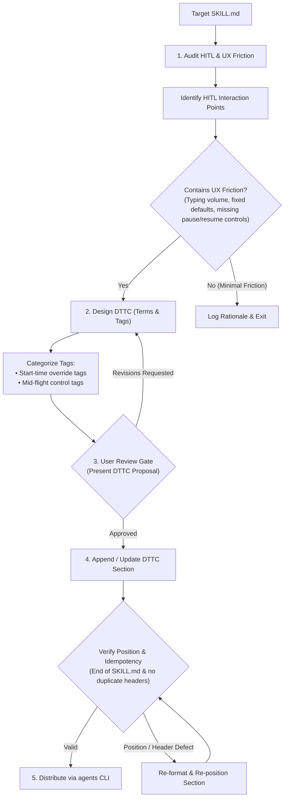

# Write Skill DTTC (Domain Terms and Tag Commands)

Audit human-in-the-loop (HITL) interaction points in target skill workflows, eliminate UX friction, and append standardized Domain Terms and Tag Commands (DTTC) to the end of target `SKILL.md`.

## Workflow & Decision Tree



## Execution Protocol

### Step 1: HITL & UX Friction Audit
Inspect target `SKILL.md` workflow and answer two audit questions:
1. **Human-in-the-loop (HITL) points**: Identify all steps where the user must or should intervene during execution (e.g., initial prompt/plan approval, mid-flight adjustments, error recovery, parameter overrides).
2. **UX Friction points**: Identify which HITL points create friction:
   - High typing volume (requiring paragraphs instead of short flags).
   - Inflexible defaults (requiring manual plan edits to change a single integer/threshold).
   - Inability to pause or update parameters mid-flight.

*Exit Condition*: If the audit reveals minimal or no UX friction, log the rationale explaining why interactive tags are unneeded and exit execution without modifying target `SKILL.md`.

### Step 2: DTTC Design & Tag Worthiness Test
Design explicit Domain Terms and Tag Commands specific to the target skill domain:

MUST read [REFERENCE.md](REFERENCE.md) via `view_file` before designing tag commands to evaluate case studies comparing HITL friction against DTTC solutions.

- **Tag Worthiness Test (Preventing Tag Inflation)**:
  - **Create Tag ONLY IF**:
    - High Repetition: Interactively used repeatedly across sessions/iterations.
    - Parameter Override: Modifies a parameter/flag without altering the core workflow.
    - Compact Notation: Can be expressed in 2-3 uppercase letters.
  - **REJECT Tag IF**:
    - One-off action or rarely executed.
    - Requires verbose explanations or alters the primary execution protocol.
    - Low Savings: Saves only a few keystrokes while adding permanent context load.

- **Domain Terms**: Define shared concepts, roles, or metrics for human and agent alignment.
- **Tag Command Syntax & Naming Rules**:
  - **Syntax Structure**: `!<TAG><ARG>`
  - **`<TAG>`**: 2 to 3 uppercase letters (e.g. `!XX`, `!YYY`). Must be case-insensitive when invoked by the user (matching both `!xx` and `!XX`).
  - **`<ARG>` (Optional)**: Optional payload accompanying the tag, such as a numeric threshold (`<N>`), flag, or instruction string (`[Instructions]`).
  - **Timing & Purpose Categories**:
    - **Start-time tags**: Override launch parameters, flags, or default thresholds at initial skill invocation.
    - **Mid-flight control tags**: Adjust execution flow, request prompt updates, or pause after completing a step/iteration.

### Step 3: User Review Gate
Present the proposed DTTC specification (Domain Terms, Tag syntax, defaults, and trigger behaviors) to the user for review.
- Incorporate user feedback or additional tag suggestions.
- Do NOT edit target `SKILL.md` until explicit user approval is granted.

### Step 4: Idempotent DTTC Append
Upon receiving user approval:
1. **Idempotency & Collision Check**: Inspect target `SKILL.md` for an existing `## Domain Terms and Tag Commands` section.
   - If present: Merge newly approved tags into the existing section AND re-position the section to the very end of target `SKILL.md` if it is not currently at the bottom (updating any Table of Contents links if present).
   - If absent: Create and place the DTTC section at the **very end** of target `SKILL.md`.
2. **Formatting Enforcement**: Ensure no trailing content exists after the DTTC section. Format using the standard template below.

### Step 5: Skill Distribution
Sync changes across workspace targets via `agents --target <target-repo>` (or `agents --distribute`).

---

## Standard DTTC Section Template

Place this exact structure at the bottom of target `SKILL.md`:

```markdown
## Domain Terms and Tag Commands

The <skill-name> supports specialized modifier tags and domain terminology to control execution flow and parameters. User might invoke these commands in either uppercase or lowercase:

- **`<DOMAIN_TERM>`**: [Concise definition of the shared concept].
- **`!<TAG><ARG>` (<Full Name>)**: [Primary purpose].
  - **Syntax/Parameter**: `!<TAG><ARG>` (Default: `<default_value>` - include default only if tag accepts an <ARG>).
  - **Timing**: [Start-time / Mid-flight].
  - **Agent Action**: [Explicit step-by-step action taken by agent upon receiving tag].
```
