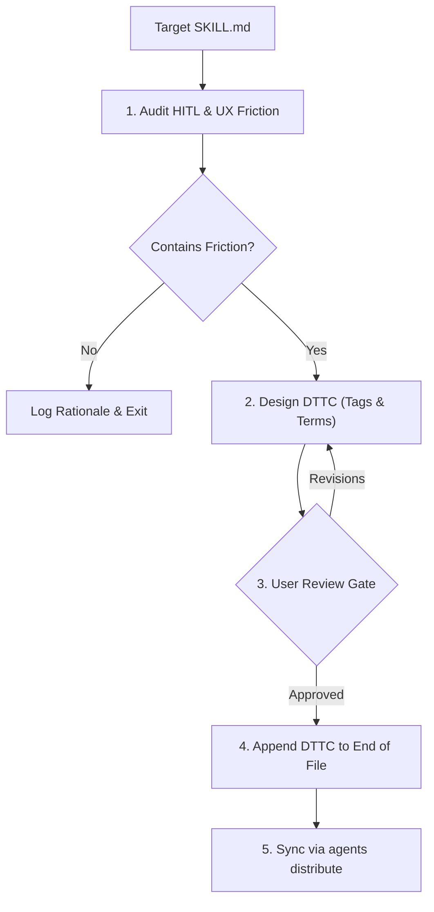

# Write Skill DTTC

Audit human-in-the-loop (HITL) interaction points in skill workflows and append standardized Domain Terms and Tag Commands (DTTC) to the bottom of target `SKILL.md`.

## Workflow



---

## Directives

1. **Tag Worthiness**: MUST verify candidate tags against the Evaluation Matrix in [REFERENCE.md](REFERENCE.md). Reject low-savings or one-off tags.
2. **Syntax Format**:
   - MUST use `!<TAG><ARG>` (2–3 uppercase letters, e.g., `!SP<N>`, `!PU [Text]`, `!PA`).
   - Tag handling MUST be case-insensitive (`!sp2` matches `!SP2`).
3. **Placement & Idempotency**:
   - DTTC section MUST always be placed at the **very bottom (EOF)** of target `SKILL.md`.
   - If a DTTC section already exists, merge new tags and reposition the section to EOF.
4. **Approval Gate**: NEVER modify target `SKILL.md` before explicit user approval.

---

## Template (`SKILL.md` Bottom Section)

Append this exact structure to the bottom of target `SKILL.md`:

```markdown
## Domain Terms and Tag Commands

The `<skill-name>` supports modifier tags and domain terminology to control execution flow:

- **`<DOMAIN_TERM>`**: [Concise definition of the shared concept].
- **`!<TAG><ARG>` (<Full Name>)**: [Primary purpose].
  - **Syntax/Parameter**: `!<TAG><ARG>` (Default: `<default_value>`).
  - **Timing**: `[Start-time / Mid-flight]`.
  - **Agent Action**: [Explicit step-by-step action taken upon receiving tag].
```

---

## Execution Steps

1. **Audit Friction**: Identify typing volume, rigid thresholds, or missing mid-flight controls in target `SKILL.md`. If none, exit.
2. **Design Tags**: Categorize into Start-time (`!TAG<ARG>`) vs Mid-flight (`!TAG [Text]`). See [REFERENCE.md](REFERENCE.md).
3. **Present Plan**: Output proposed DTTC specification for user alignment.
4. **Append & Distribute**: Upon approval, append template to EOF of target `SKILL.md` and run `agents distribute`.
