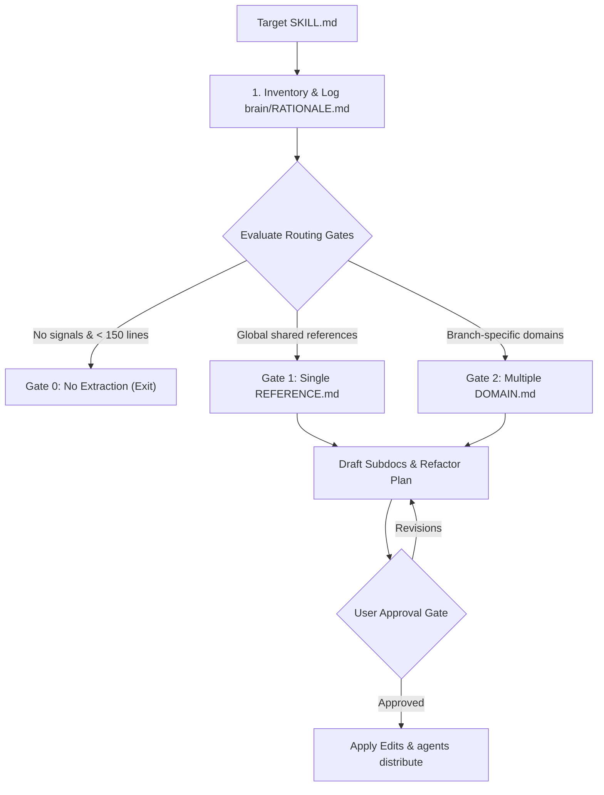

# Write Skill Subdocs

Extract heavy reference material (lookup tables, schemas, templates) from `SKILL.md` into auxiliary sub-documents (`REFERENCE.md` or `<DOMAIN>.md`) via progressive disclosure.

## Workflow



---

## Directives

1. **Optimization Invariant**: MUST minimize $\sum(\text{reference bytes loaded per execution path})$ per [HEURISTICS.md](../write-a-skill/HEURISTICS.md).
2. **1-Level Depth Limit**: Extracted sub-documents MUST be 1-level deep relative to `SKILL.md`; NEVER link nested sub-documents from within a subdoc.
3. **No Over-Specification**: When linking extracted subdocs from `SKILL.md`, MUST use concise topic anchors (e.g., `- Domain rules: see [DOMAIN.md](DOMAIN.md)`) without cataloging internal contents.
4. **Approval Gate**: NEVER edit target `SKILL.md` or write subdocs before presenting `RATIONALE.md` and obtaining explicit user approval.

---

## Routing Gates

| Gate | Condition | Action |
| :--- | :--- | :--- |
| **Gate 0 (No Extraction)** | No primary signals in [HEURISTICS.md](../write-a-skill/HEURISTICS.md) AND linear prose < ~150 lines | Log rationale in `RATIONALE.md` and exit without modifying files. |
| **Gate 1 (Single Subdoc)** | Primary signals present, but references are globally needed across all paths | Extract to single `REFERENCE.md`. |
| **Gate 2 (Domain Subdocs)** | Primary signals present and isolated to independent execution branches | Extract to multiple `<DOMAIN>.md` files (Overlapping Subdocs Principle). |

---

## Execution Protocol

1. **Audit & Log Baseline**: Create `<appDataDir>/brain/<convo-id>/RATIONALE.md` using the matrix template:
   ```markdown
   # Subdoc Extraction Rationale: <skill-name>
   ## Baseline Audit
   - **SKILL.md Size**: X lines | Y bytes
   - **Existing Subdocs**: [list or "None"]
   
   ## Information Component Analysis
   | ID | Information Component | Needed Every Run? | Trigger | Dependencies | Decision |
   | :---: | :--- | :---: | :--- | :--- | :--- |
   | A | <Component Name> | YES / NO | [Signal from HEURISTICS.md] | None | Extract to REFERENCE.md |
   ```
2. **Evaluate Gates**: Check criteria against the Routing Gates table above.
3. **Draft & Present**: Output proposed subdocs and `SKILL.md` diff in `RATIONALE.md` for user approval.
4. **Apply & Distribute**: Write subdocs, replace extracted sections in `SKILL.md` with relative links, and run `agents distribute`.
