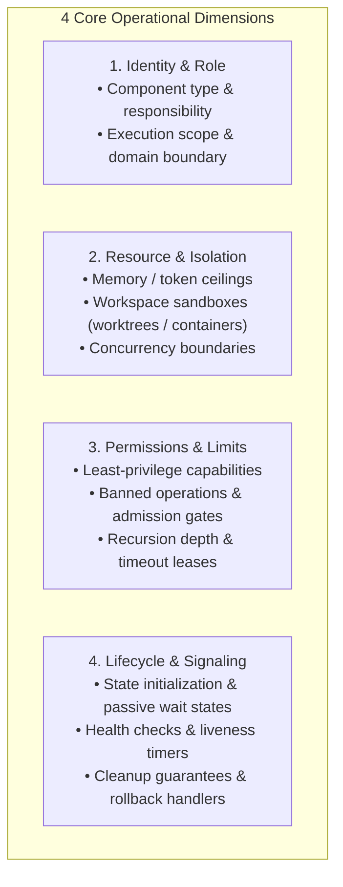

# Reference: Logic & Invariants Architecture Engine

This document provides universal domain mapping patterns, configuration dimensions, state machine templates, and canonical case studies for explaining complex systems.

---

## 1. Universal Domain Mapping Dictionary

Translate abstract computer science concepts into concrete domain rules, state invariants, and causal boundaries:

| Abstract Concept | Causal & State Invariant Framing | Canonical Domain Translation |
| :--- | :--- | :--- |
| **Race Condition / Concurrency Bug** | Two concurrent operations update the same shared balance without atomic locking, allowing both to succeed on stale data. | Two users checkout the last available inventory slot simultaneously, causing double booking. |
| **Deadlock** | Process A holds Resource 1 and waits for Resource 2, while Process B holds Resource 2 and waits for Resource 1 with neither releasing. | Worker A locks Order Table and waits for Customer Table; Worker B locks Customer Table and waits for Order Table. |
| **Cache Invalidation / Stale Reads** | A write mutates the persistent database, but the fast-read memory layer serves un-invalidated previous state. | User updates shipping address, but invoice generator reads old address from unexpired session cache. |
| **Circuit Breaker** | A subsystem tracking downstream failures temporarily stops sending requests after hitting an error threshold to protect both systems. | Payment gateway fails 5 consecutive times; checkout redirects users to backup payment method immediately without hanging. |
| **Idempotency** | Repeating the same network request multiple times produces the exact same system state as executing it once. | Submitting the payment button three times during a network lag charges the credit card exactly once using a unique transaction key. |
| **Sandboxing & Isolation** | An isolated environment running unverified code or operations with restricted disk, network, and process permissions. | A worker process executing customer-uploaded scripts with read-only filesystem access and no external internet socket. |
| **Least Privilege** | Granting a component only the minimal permissions and scopes necessary to perform its designated task. | A report generator subagent equipped with read-only file access and banned from modifying production databases. |
| **Backpressure** | A downstream consumer signaling an upstream producer to pause or slow down message emission when its queue fills up. | Image processing worker tells upload queue to throttle intake when buffer reaches 1,000 pending jobs. |

---

## 2. Four Core Configuration Dimensions (Mental Reference for Mode 2)

When analyzing or explaining concrete system mechanics (**Mode 2**), evaluate parameters across these four functional dimensions:



---

## 3. State Transition & Invariant Models (Universal Hello World)

When structuring concrete state transitions (**Mode 2** or **Mode 4**), use clear causal logic:

### Pattern A: Atomic Reservation with Automatic Rollback (Inventory / Resource Slot)
```text
1. State Model:
   - Primary State: 'Reserved Slots' (confirmed capacity).
   - In-Flight State: 'Pending Claims' (operations currently validating payment).
2. Admission Gate (Precondition):
   - Action authorized ONLY IF: (Reserved Slots + Pending Claims) < Capacity Ceiling.
   - If capacity reached: Reject request immediately with clear capacity exhausted signal.
3. Causal Flow (State Transitions):
   - On checkout request: Increment Pending (+1), mark transaction as in-flight.
   - On payment confirmation: Decrement Pending (-1), increment Reserved (+1).
   - On payment failure or timeout: Decrement Pending (-1), restore available capacity (Rollback).
4. Safety Guarantees & Invariants:
   - Capacity Invariant: Total reserved slots never exceed maximum capacity under concurrent load.
   - Leak-Free Invariant: Aborted or timed-out transactions safely release pending reservations.
```

---

## 4. Canonical Case Studies

### Case Study 1: Mode 1 (Conceptual Overview) — Subagent Mechanism
**User Prompt:** *"Explain how subagents work."*

**Model Response (Linear Knowledge, Boundary & Invariant Focused):**
> Subagents are independent, isolated agent processes spawned by a parent agent to execute specialized, focused tasks in a clean context window without polluting the parent's conversational state.
>
> #### Core Problem Solved:
> In complex coding tasks, executing deep file reading, multiple test runs, or lengthy searches directly in the main conversation causes **Attention Drift** and **Context Window Exhaustion**, degrading reasoning quality.
>
> #### Key Boundaries & Invariants:
> 1. **Context Isolation:** Each subagent receives its own clean context window containing only its designated task prompt and domain instructions.
> 2. **Controlled Workspace Sandboxing:** Subagents can operate in the parent workspace (`inherit`) or in isolated, throwaway branches (`branch`) to prevent unintended side-effects.
> 3. **Hierarchical Communication:** Subagents report results back to the parent agent upon completion; they do not interact directly with the user.

*(Agent stops here without dumping parameter catalogs or micro-state tables unless the user asks for operational mechanics).*

---

### Case Study 2: Mode 2 (System Mechanics) — Safe Save File Deserializer
**User Prompt:** *"Explain how the save deserializer handles untrusted pickle files."*

**Model Response (Linear Grounding, Terminology Equipped, Zero Implementation Trivia):**
> When games save their progress, some engines store the data as a sequence of computer instructions rather than plain text. If a player downloads a shared save file from the internet, a malicious creator could embed destructive system commands inside those instructions.
>
> To eliminate this danger, the deserializer processes save files through a **Sandboxed Bytecode Interpreter** that strictly separates data construction from code execution.
>
> ```mermaid
> flowchart TD
>     RAW["Raw Save File from Disk"] --> PARSER["Sandboxed Bytecode Interpreter<br/>(Reads instructions one by one)"]
>     PARSER --> VALIDATE{"Instruction Type?"}
>     VALIDATE -->|"Safe Data (Numbers, Strings, Lists, Dictionaries)"| BUILD["Construct In-Memory Game State"]
>     VALIDATE -->|"Execution Command (Run Function / Launch Program)"| REJECT["Reject Immediately with SaveCodecError<br/>(PARSE_FAILED: Unsafe Instruction)"]
>     BUILD --> SANITIZE["Prototype Sanitization Matrix<br/>(Neutralize Object Injection Keys)"]
>     SANITIZE --> MODEL["Clean Editor Model"]
> ```
>
> #### Key Mechanisms & Invariants:
> 1. **Zero Dynamic Evaluation (No Arbitrary Code Execution):**
>    The interpreter acts as a strict filter. It executes primitive instructions that assemble numbers, text, and dictionaries, but immediately aborts if it encounters instructions that attempt to instantiate external classes or invoke operating system functions.
> 2. **Resource Clamping (Denial of Service Defense):**
>    To prevent a malformed file from causing an infinite loop or freezing the application, the interpreter enforces strict resource ceilings: a maximum operation count (500,000 steps) and a maximum in-memory object reference limit (50,000 entries).
> 3. **Prototype Pollution Immunity:**
>    In JavaScript runtimes, objects share a common master template. An attacker can craft special property names (`__proto__`, `constructor`) to alter that master template and corrupt application behavior. The deserializer strips these keys recursively before returning the data to the application.
